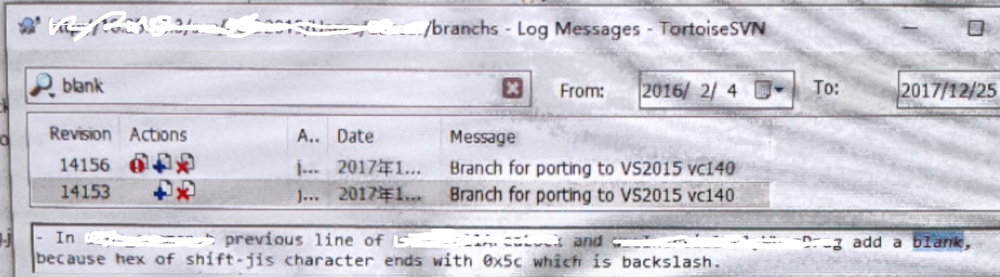

#! https://www.zhihu.com/answer/2071005675


# 一个空格就可以修复的BUG

本文绝对真实，有图为证。




大家能看出来这个Bug是怎么修复的吗？没错，就加了一个空格。

事情的起因是这样的，有一天，我厌倦了在VC++中编写代码，于是我决定将代码移植到VS2015中。在解决了各种问题后，有一个问题始终没有解决，那就是提示我某个变量没有定义。这么可能呢，明明啥都没改，并且那个变量就在我眼前显示着。

```c
int neng; // 能
int why_am_i_not_defined; // Why?
```

不知道经过了多久的冥思苦想（毕竟年代久远），我终于有了一点头绪：那就是`能`的编码有问题。[在Shift-JIS编码（日文最常用的编码）中，`能`的编码是`0x945c`](https://www.mp51.vip/Code/DetailCodes?wd=%e8%83%bd)。`5C`是啥，`5C`在ASCII中就是反斜杠`\`。所以上面的代码编译器看到的是这样的：

注：下面这个示例和上面的例子是我从同一个文件拷贝的，唯一的区别就是用不同的编码打开了文件。
```c
int neng; // �\
int why_am_i_not_defined; // Why?
```

这个问题最坑的地方在于，在编辑器里显示的时候是完全正常的。你看到的和编译器看到的是不一样的。

这也告诉我们，不要在代码中放置非ASCII字符。并且在尽可能的情况下使用[UTF-8](https://utf8everywhere.org/)。
