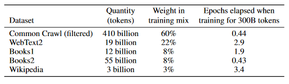

自问自答一下。本来是想写一篇专栏的，但由于个人见解毕竟有限，所以以问答的形式和大家探讨。

# GPT-3和Copilot的比较

## 出身

从出身来说，[GPT-3](https://arxiv.org/abs/2005.14165)和[Copilot](https://copilot.github.com/)都是[OpenAI](https://openai.com/)的背景。

## 训练集

从训练的数据集来说，GPT-3主要使用的是互联网的文本：

Copilot使用的主要也是互联网上公开的代码[^1]。

> What data has GitHub Copilot been trained on?
>
> GitHub Copilot is powered by OpenAI Codex, a new AI system created by OpenAI. It has been trained on a selection of English language and source code from publicly available sources, including code in public repositories on GitHub.

显然，GPT-3和Copilot的训练数据集都是（未获得授权的，如果需要的话）互联网上的公开数据。

## 输出

GPT-3和Copilot的都有可能输出训练集的内容[^2][^3]。甚至GPT-3可能输出隐私信息[^2]。

# 对版权的一些思考

为什么GPT-3和Github Copilot收到的待遇很不一样？

在我看来它们核心好像是一样的，只不过一个生成的是文本，一个生成的是代码。

也没有证据表明GPT-3的训练文本是得到授权的。

[^1]: https://copilot.github.com/#faq-what-data-has-github-copilot-been-trained-on
[^2]: https://bair.berkeley.edu/blog/2020/12/20/lmmem/
[^3]: https://mp.weixin.qq.com/s/xX6Ib2ZWObBwTdJmtiocUw
