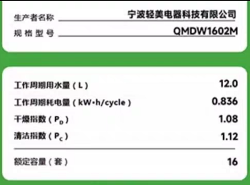
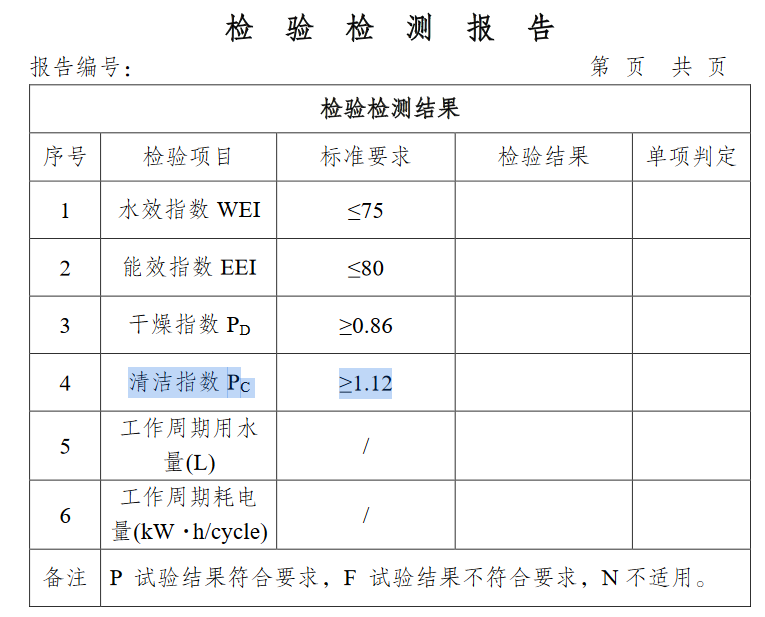

在买洗碗机的时候，商家会宣传省电节水，然后消费者为了省水省电的功能付出了几百块的溢价。

那洗碗机究竟有多费水费电。通常，只要在购买页面拉到详情页的最下面，都能看到一个水效标识。
以米家的N1为例：

可以看到，一次工作的耗水量是12L，即0.012立方米。耗电是0.863度。

假设水价是4.5元/立方米（包括污水处理费），电价是0.65元/度（一阶峰电）。

$$ 水费 = 0.012 * 4.5 = 0.054元 $$ 

$$ 电费 = 0.863 * 0.65 = 0.56095元 $$

$$ 合计 = 0.054 + 0.56095 = 0.61495元 $$

假设一年共使用200次，则

$$ 水费 = 0.054 * 200 = 10.8 元 $$ 

$$ 电费 = 0.56095 * 200 = 112.19 元 $$

$$ 合计 = 0.61495 * 200 = 122.99 元 $$

可以看到，水费几乎可以忽略不记，电费也不算很多。即使有高科技，一年可以省四分之一的费用，也不过30元左右。而为这些技术付出的价格可能在整个生命周期都补不回来。

关于水效标识的其它参数，可以参考[洗碗机水效标识实施规则.pdf](https://www.gov.cn/zhengce/zhengceku/2020-10/18/P020240813648200123470.pdf)。以清洁指数$P_C$为例，通常三千左右的机型也就将将达到最低标准1.12。
。想要更好的清洁指数，通常价格不会太低。

最后，水效标识可以在线查询，网址为<http://www.waterlabel.org.cn/sxbs/cpbaxx/display.htm>。

再最后，建议可以将洗碗机定时到晚上十点后再开始工作，通常十点后电费半价。
