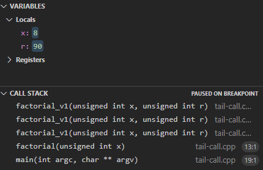
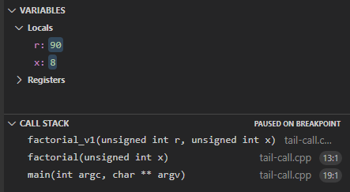

#! https://zhuanlan.zhihu.com/p/379985546
# C/C++的尾递归优化

我们都知道[Scheme](https://r6rs.mrliu.org/#s11-20)是有严格的尾递归优化的，本文我们来探究一下gcc对C/C++尾递归所作的优化。

本文通过查看调用栈的层数来检查编译器是否进行了尾递归优化。示例（求`x`的阶乘`x!`）

```c++
unsigned factorial_if_1(unsigned x, unsigned r)
{
    if (x == 0)
        return r;
    else
        return factorial_if_1(x-1, x*r);
}

unsigned factorial(unsigned x)
{
    return factorial_if_1(x, 1);
}

// 调用factorial(10)
```

当我们以`-O1`的优化等级编译时，其递归三次后的调用栈如下。



我们可以看到，每调用一次，栈就深一层，说明没有优化。


我们再以`-O2`的优化再次编译运行：



此时，不管递归几次，调用栈都不会再增加，说明进行了优化。

下面我们对编译器可能进行优化的地方一一试验。

我的编译器版本是：

```bash
$ g++ --version
g++ (Ubuntu 11.1.0-1ubuntu1~20.04) 11.1.0
Copyright (C) 2021 Free Software Foundation, Inc.
This is free software; see the source for copying conditions.  There is NO
warranty; not even for MERCHANTABILITY or FITNESS FOR A PARTICULAR PURPOSE.
```

# `if`语句

`if`语句的一种情况上面已经介绍了，下面我们介绍另外一种情况：递归在`if`的上半句

```c++
unsigned factorial_if_2(unsigned x, unsigned r)
{
    if (x > 0)
        return factorial_if_2(x-1, x*r);
    else
        return r;
}
```

我们发现，在`-O2`时也是有优化的。

# `switch`

```c++
unsigned factorial_switch_1(unsigned x, unsigned r)
{
    switch (x) {
    case 0:
        return r;
    default:
        return factorial_switch_1(x-1, x*r);
    }
}
```

```c++
unsigned factorial_switch_2(unsigned x, unsigned r)
{
    switch (!x) {
    case 0:
        return factorial_switch_2(x-1, x*r);
    default:
        return r;
    }
}
```

我们发现，在`-O2`时也是有优化的。

# `||`表达式

```c++
// Never return when init x in not even
// Haha
bool is_even_or(unsigned x, bool ret, bool r)
{
    return ret || is_even_or(x-1, r&&(x==0), !r);
}
```

有优化。

# `&&`表达式

```c++
// Never return when init x is even
// Haha
bool is_even_and(unsigned x, bool ret, bool r)
{
    return ret && is_even_and(x-1, r||x, !r);
}
```

有优化。

# `?:`表达式

```c++
unsigned factorial_tri_1(unsigned x, unsigned r)
{
    return x == 0 ? r : factorial_tri_1(x-1, x*r);
}

unsigned factorial_tri_2(unsigned x, unsigned r)
{
    return x ? factorial_tri_2(x-1, x*r) : r;
}
```

有优化。

# λ表达式

```c++
    auto factorial_lambda = [](auto&& self, unsigned x1, unsigned r) -> unsigned {
        if (x1 == 0)
            return r;
        else
            return self(self, x1-1, x1*r);
    };
    return factorial_lambda(factorial_lambda, x, 1);
```

看不到调用栈，可能需要查看反汇编。猜测也是有的。以后有时间再详细研究。

# 结论

GCC在`-O2`的优化级别会对C/C++进行尾递归优化。
