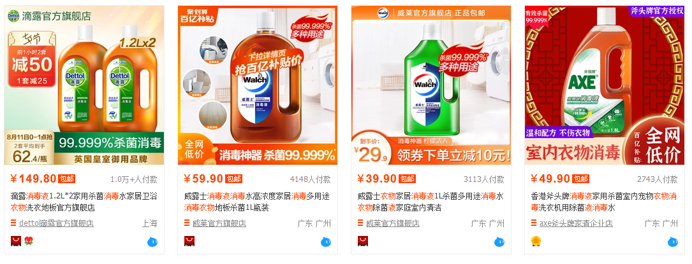
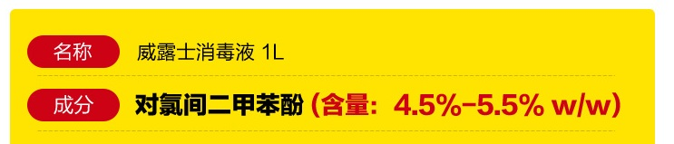
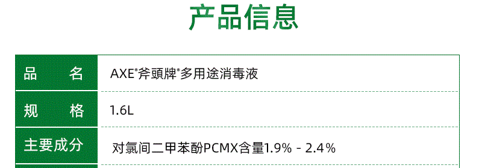

# 如何选择最具性价比的衣物消毒液

很多人总觉得洗衣机洗衣服会洗不干净衣服（尤其美女同志们），所以衣物消毒液开始流行。本文试图帮大家找到最具性价比的产品。

- 本文对于消毒液类型的好与坏不作探讨，仅仅帮大家在同一类型的产品中试图找到最具性价比的产品。
- 本文只讨论衣物消毒剂，不讨论其它消毒产品。
- 本文讨论的消毒剂不包括有抑菌作用的衣物柔顺剂。

注意：大部分消毒剂具有毒性，会损伤皮肤及粘膜。建议佩戴口罩及手套进行操作，并注意通风。

# 衣物消毒液的类型

以前最常用的就是84了。84主要成分为次氯酸钠，便宜有效，一大问题是会使衣物褪色，谁用谁知道，所以这里就不推荐了。

淘宝搜素“衣物消毒液”，排名靠前的主要是这几大类：
- 对氯间二甲苯酚（PCMX）
- 十二烷基二甲基苄基氯化铵（Benzyldimethyldodecylammonium chloride）
- 季铵盐（烷基二甲基苄基氯化铵）

其中以对氯间二甲苯酚最为流行，料想主要是因为其价格便宜的缘故。

# 如何才最具性价比

1. 第一层：哪个单价便宜。比如A十元一瓶，B二十元一瓶。那么A比B更具性价比。
2. 第二层：看每毫升单价。聪明的你很容易就会发现，A和B的净含量可能不同，A是500mL，B是2L。此时我们需要使用单价除以净含量，得到每毫升单价。
3. 第三层：这一层可能就很多人不会注意了。比如题图的第二个和第四个商品：
   - 威露士，1L，59.9元
   - 斧头，1.6L，49.9元

看上去斧头是既多又便宜，但是我们看一下商品详情：

是不是哪个便宜就不太好区分了。

那我就来帮大家计算一下：这里我们约定，含量取最低值，即威露士4.5%，斧头1.9%。道理你懂的。

- 威露士：$\frac{59.9}{1000 * 4.5\%}=1.331$
- 斧头：$\frac{49.9}{1600 * 1.9\%}=1.641$

计算可知，威露士的单价更加便宜。

这里我们定义由以上公式计算出的值叫做**价格指数**。显然，价格指数越低就越便宜。

# 推荐几款
下面是我按分类找到的价格指数较低的产品（随便翻了翻，没有认真找）。如果你找到了更低的，评论或私信我，我会更新。

## 对氯间二甲苯酚（PCMX）

- 滴露、1.8L*2，166.5元（185元9折），4.3%

价格指数：1.076

## 十二烷基二甲基苄基氯化铵
- 威露士、1L*2，59.9元（109元-50元券），2.25%

价格指数：1.331

