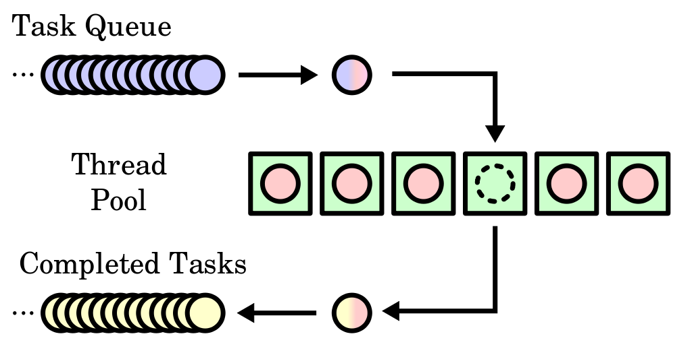

#! https://zhuanlan.zhihu.com/p/375279181
# 使用C++20协程（Coroutine）实现线程池

[C++20的协程](https://en.cppreference.com/w/cpp/language/coroutines)出来了也有好一段时间了，不过说实话，那几个关键字的语义过于复杂了，基础设施严重不足呀。

废话不多说，下面就用协程来实现一个线程池吧。

本文分为两个部分：第一部分是协程的简明教程，第二部分是使用协程实现一个thread pool。已经熟悉协程的朋友可以跳过第一部分。

# 一、C++20协程

## 协程定义

> 一个事物没有定义，那便失去了灵魂。
> .....................................................—— 鲁迅

协程是一个**函数**，是一个可以暂停（**suspend**）和恢复（**resume**）的函数。

从C++语法的角度来讲，协程是包含下面三个关键字中一个或多个的函数。

- `co_await`
- `co_yield`
- `co_return`

例，下面的函数是一个协程

```c++
int add1(x)
{
    co_return x+1;
}
```

## 协程的其它重要概念

协程总是和下面三个东东相关联：

- Promise对象：用于返回结果，或异常，需要我们自己定义
- 协程handle：[`std::coroutine_handle`](https://en.cppreference.com/w/cpp/coroutine/coroutine_handle)，我们通过这个handle来**resume**或**destroy**这个协程
- 协程状态：我们把它交给编译器，暂时无需考虑

另外还有一个很重要的概念是`Awaitable`对象。

上面的这些概念，我们会一个一个地讲解。

## Promise对象

Promise对象的类型是编译器根据协程自动推导出来的。一种简单的情况如下：

```c++
struct my_return_t {
    struct promise_type {
        // ......
    };
};

my_return_t my_coro(x)
{
    co_yield 1;
}
```

上面这个例子中，协程`my_coro`的Promise对象的类型就是`my_return_t::promise_type`。即如果一个协程的返回类型是`R`，那么它的Promise类型就是`R::promise_type`。

当然上面只是一种常用的情形，更复杂的比如上面的`int add1(x)`协程，根本不存在`int::promise_type`。这个这里暂时就不介绍了，喜欢刨根问底的亲们可以参考[`std::coroutine_traits`](https://en.cppreference.com/w/cpp/coroutine/coroutine_traits)。

更进一步，`promise_type`需要定义如下函数：

```c++
struct my_return_t{
  struct promise_type {
    my_return_t get_return_object();
    awaitable initial_suspend();
    awaitable final_suspend() noexcept;
    void return_void();
    void return_value(some_type);
    awaitable yield_value(some_type);
    void unhandled_exception();
  };
};
```

注意`return_void`和`return_value`不会同时存在。关于awaitable见下一小节，其余函数的意义，后面再讲解。

## Awaitable对象

可以Awaitable理解成一个类，名字不重要，但必须定义了以下三个函数：

```c++
struct my_awaitable_t {
    bool await_ready();
    void await_suspend(std::coroutine_handle<> h);
    void await_resume();
};
```

注意上面的函数可能会有不同的返回值类型，我们先忽略这个问题。

本文又是也将Awaitable对象称为awaiter，大家自行联系上下文。

## 协程handle

我们注意到上一节的`await_suspend`函数，其参数是`std::coroutine_handle<> h`，这便是协程handle了。如上所说，通过它可以实现两个重要的操作：恢复/销毁一个协程。

```c++
h.resume();
h.destroy();
h(); // 等同于h.resume();
```

## `co_await`

有了上面的讲解，我们到了协程的核心部分，`co_await`操作符。它的作用是**暂停当前协程，并将控制权交给调用者（Caller）或恢复者（Resumer）**。

语法：`co_await expr`

第一步，`expr`会通过某种规则转换为awaitable对象，或者简单一点说，`co_await`后接一个awaitable对象：`co_await awaitable`。

我们知道Awaitable对象包含三个函数，我们正式通过这三个函数来控制协程的交互。

我们以下面这个例子介绍`co_await`如何执行

```c++
auto x = co_await awaitable
```

- 执行`awaitable.await_ready()`，这个函数通常返回`false`，表示`co_await`还没有准备好计算一个值给`x`，所以协程会暂停并准备准备交出控制权；
- 在交出控制权之前会执行`awaitable.await_suspend(handle)`，这个函数会将协程handle保存在某个地方，以便后续的恢复或销毁。简便起见，`await_suspend`函数返回`void`（对其它返回值感兴趣的亲们可以参考[这里](https://zh.cppreference.com/w/cpp/language/coroutines)）
- 返回控制权给调用者或回复者

~~然后~~，如果在其它地方有人调用了`handle.resume()`，那么这个协程就又被恢复了，被恢复的协程立刻执行以下操作：

- 执行`awaitable.await_resume()`
- 将`await_resume()`的返回值赋值给`x`

自此，`auto x = co_await awaitable`就算执行完毕。

### 协奏曲一

那如果`awaitable.await_ready()`返回`true`呢？那就更简单了，说明`co_await`已经准备好了，直接执行`awaitable.await_resume()`并赋值给`x`，就不暂停了。

### 协奏曲二

**注意**：有时候`handle.resume()`在`awaitable.await_suspend(handle)`返回前就被执行了，比如你在`await_suspend`中开了一个线程来执行`resume()`。如果你有类似的操作，那你就要注意。这意味着有一定的可能性`auto x = co_await awaitable`已经（在另一个上下文中）执行完毕，而你的`await_suspend`还没有返回，此时，`awaitable`临时对象可能已经被销毁，那么`awaitable.await_suspend`就不能安全地访问`this`指针。这条注意要多看几遍，可能你第一次看的时候会觉得看不懂，只要你看懂了，你的协程知识就算入门了。

### 协奏曲三：两个常用的Awaitable对象

- 一个是[`std::suspend_always`](https://en.cppreference.com/w/cpp/coroutine/suspend_always)，它的`await_ready`总是返回`false`，另外两个函数都是空的。
- 一个是[`std::suspend_never`](https://en.cppreference.com/w/cpp/coroutine/suspend_never)，它的`await_ready`总是返回`true`，另外两个函数也都是空的。

这两个类型人如其名。

## 协程的执行

有了上面的基础之后，我们就可以一探协程的执行了。

```c++
my_return_t my_coro()
{
    co_await my_awaitable_t();
}
```

协程`my_coro`执行步骤如下（关键步骤）：

- 以类型`my_return_t::promise_type`构造`promise`对象
- 由于我们的协程返回一个`my_return_t`的对象，所以调用`promise.get_return_object`生成一个。这个对象很重要，协程靠它和调用者/回复者传递信息。每当协程让出控制权返回时，它将作为返回值被返回。
- 执行`co_await promise.initial_suspend()`。通常`initial_suspend`会返回`suspend_always`或`suspend_never`。注意，这里我们还没有开始执行协程的函数体，就已经（可能）有控制权的转移了。
- 执行协程的函数体
    * 普通语句照常执行
    * `co_await`：如上所述
    * `co_yield expr`：等价于`co_await promise.yield_value(expr)`
    * `co_return`：调用`promise.return_void()`或`promise.return_value(expr)`
        - 调用`promise.return_void()`的情况
            * 执行空的`co_return;`
            * 执行`co_return expr;`，但`expr`的类型是`void`
            * 到达函数结尾，执行了一个隐含的空`co_return;`
        - 调用`promise.return_value(expr)`的情况
            * 执行`co_return expr;`，且`expr`的类型不是`void`
- 销毁所有协程的自动变量
- 执行`co_await promise.final_suspend()`
- 销毁`promise`
- 返回调用之/恢复者

## 协奏曲四：协程例

这里用协程实现了`range`操作，并添加了`for`循环的支持。

```c++
#include <coroutine>
#include <iostream>
#include <stdexcept>
#include <thread>

struct range_t
{
    struct promise_type;
    struct awaitable
    {
        bool await_ready()
        { 
            std::cout << __func__ << std::endl;
            return false; 
        }
        void await_suspend(std::coroutine_handle<> h)
        {
            std::cout << __func__ << std::endl;
            m_promise->m_h = h;
        }
        void await_resume() 
        {
            std::cout << __func__ << std::endl;
        }
        
        promise_type *m_promise;
    };

    struct promise_type
    {
        range_t get_return_object() { 
            std::cout << __func__ << std::endl;
            return {this}; 
        }
        std::suspend_never initial_suspend() 
        { 
            std::cout << __func__ << std::endl;
            return {}; 
        }
        std::suspend_always final_suspend() noexcept         
        { 
            std::cout << __func__ << std::endl;
            return {}; 
        }
        void return_void()      
        { 
            std::cout << __func__ << std::endl;
            m_end_flag = true;
        }
        awaitable yield_value(int x)
        {
            std::cout << __func__ << std::endl;
            m_x = x;
            return awaitable(this);
        }
        void unhandled_exception()     
        { 
            std::cout << __func__ << std::endl;
        }

        bool m_end_flag = false;
        int m_x = -1;
        std::coroutine_handle<> m_h;

        promise_type() {
            std::cout << __func__ << std::endl;
        }
    };


    struct iter
    {
        range_t *r;

        bool operator!=(const nullptr_t &_)
        {
            return !r->m_promise->m_end_flag;
        }

        iter& operator++()
        {
            r->m_promise->m_h();
            return *this;
        }

        int& operator*()
        {
            return r->m_promise->m_x;
        }
    };

    iter begin()
    {
        return iter(this);
    }

    nullptr_t end()
    {
        return nullptr;
    }

    promise_type *m_promise;
};

range_t range(int stop)
{
    std::cout << __func__ << " enter" << std::endl;
    for (int i=0; i<stop; ++i) {
        std::cout << "\n++before co_yield" << std::endl;
        co_yield i;
        std::cout << "--after co_yield" << std::endl;
    }
    std::cout << __func__ << " exit" << std::endl;
}

int main()
{
    for (auto& i : range(5))
        std::cout << "* Range of " << i << std::endl;
}
```

运行结果如下

```bash
$ g++ --version
g++ (Ubuntu 11.1.0-1ubuntu1~20.04) 11.1.0
Copyright (C) 2021 Free Software Foundation, Inc.
This is free software; see the source for copying conditions.  There is NO
warranty; not even for MERCHANTABILITY or FITNESS FOR A PARTICULAR PURPOSE.
$ g++ -std=c++20 -pthread coro.cpp -o coro
$ ./coro
promise_type
get_return_object
initial_suspend
range enter

++before co_yield
yield_value
await_ready
await_suspend
* Range of 0
await_resume
--after co_yield

++before co_yield
yield_value
await_ready
await_suspend
* Range of 1
await_resume
--after co_yield

++before co_yield
yield_value
await_ready
await_suspend
* Range of 2
await_resume
--after co_yield

++before co_yield
yield_value
await_ready
await_suspend
* Range of 3
await_resume
--after co_yield

++before co_yield
yield_value
await_ready
await_suspend
* Range of 4
await_resume
--after co_yield
range exit
return_void
final_suspend
```

为方便读者更好地把握执行顺序，我给所有的协程相关的函数都打了log。

有几个注意点

- 需要给promise一个默认的构造函数
- 用了`this`指针在结构体见传递状态
- 注意`initial_suspend`和`final_suspend`有不同的返回值，想想是为什么
- 请读者找一下，`resume`是在哪里调用的

# 线程池



图片作者是[Cburnett](https://commons.wikimedia.org/wiki/User:Cburnett)，在[Creative Commons Attribution-Share Alike 3.0 Unported](https://creativecommons.org/licenses/by-sa/3.0/deed.en) license下授权。

从上图可以看到线程池需要一个Queue，用来存放待完成的任务，并且是一个线程安全的Queue。（我们忽略已完成的任务）。

我们希望像下面这样操作线程池。

```c++
// 创建一个有n个线程的线程池
auto h = thread_pool_t(n);

// 提交一个任务
h.submit(task);

// 停止这个线程池
h.stop();
```

那么线程池和协程有什么关系呢，那就是在queue中保存的是协程，更准确地说，queue中保存地是前一章提到的协程handle。

下面我们就从线程安全的Queue和线程池这两点着手。

## 线程安全的Queue

这个简单，我们将标准库中的`std::queue`包装一下就行。

```c++
#include <atomic>
#include <condition_variable>
#include <coroutine>
#include <iostream>
#include <mutex>
#include <optional>
#include <queue>
#include <stdexcept>
#include <thread>

template <typename T>
struct threadsafe_queue_t
{
    threadsafe_queue_t() {}

    void put(T task)
    {
        std::unique_lock<std::mutex> lk(m_m);
        m_queue.emplace(task);
        m_cv.notify_one();
    }

    std::optional<T> take()
    {
        std::unique_lock<std::mutex> lk(m_m);
        m_cv.wait(lk, [q = this] { return q->m_must_return_nullptr.test() || !q->m_queue.empty(); });

        if (m_must_return_nullptr.test())
            return {};

        T ret = m_queue.front();
        m_queue.pop();

        return ret;
    }

    void destroy()
    {
        m_must_return_nullptr.test_and_set();
        m_cv.notify_all();
    }

private:
    std::queue<T> m_queue;
    std::mutex m_m;
    std::condition_variable m_cv;

    std::atomic_flag m_must_return_nullptr=false;
};
```

注意以下几点：
- 函数`get`在queue中没有数据的时候会一直阻塞，知道有数据到来。
- 实现的一个`destroy`函数，目的是在停止线程池的时候有办法将阻塞在`get`中的任务唤醒，从而返回。

## Thread pool

有了上面线程安全的queue，线程池就是一个很trivial的工作了。

```c++
struct thread_pool_t
{    
    struct promise_type;
    struct awaitable
    {
        bool await_ready()
        { 
            return false; 
        }
        void await_suspend(std::coroutine_handle<> h)
        {
            m_thread_pool->m_queue.put(h);
        }
        void await_resume() {}
        
        thread_pool_t *m_thread_pool;
    };

    struct wrapper
    {
        struct promise_type
        {
            wrapper get_return_object() { return {}; }
            std::suspend_never initial_suspend() { return {}; }
            std::suspend_never final_suspend() noexcept { return {}; }
            void return_void() {}
            void unhandled_exception() {}

            promise_type() {}
        };
    };

    thread_pool_t(int thread_number)
    {
        for (int i=0; i<thread_number; ++i) {
            m_threads.emplace(std::jthread([this] {
                this->worker();
            }));
        }
    }

    template <typename T>
    wrapper submit(T task)
    {
        co_await awaitable(this);

        task();
    }

    void stop()
    {
        m_queue.destroy();
        while (!m_threads.empty()) {
            m_threads.pop();
        }
    }

    threadsafe_queue_t<std::coroutine_handle<>> m_queue;
private:
    void worker()
    {
        while (auto task = m_queue.take()) {
            task.value().resume();
        }
    }

    std::queue<std::jthread> m_threads;
};

#include <chrono>
int main()
{
    using namespace std::chrono_literals;
    auto tpool = thread_pool_t(3);
    for (int i=0; i<7; ++i) {
        tpool.submit([i]{
            std::this_thread::sleep_for(2s);
            std::cout << "* Task " << i << std::endl;
        });
    }
    std::this_thread::sleep_for(3s);
    tpool.stop();
}
```

计算结果如下

```bash
$ g++ --version
g++ (Ubuntu 11.1.0-1ubuntu1~20.04) 11.1.0
Copyright (C) 2021 Free Software Foundation, Inc.
This is free software; see the source for copying conditions.  There is NO
warranty; not even for MERCHANTABILITY or FITNESS FOR A PARTICULAR PURPOSE.

$ g++ -std=c++20 -pthread coroutine_thread_pool.cpp -o threadpool
$ ./threadpool
* Task 2
* Task 1
* Task 0
* Task 3
* Task 4
* Task 5
```

注意`main`里的例子7个任务只执行了6个，请亲们思考是为什么。

习题：`jthread`和`thread`有什么不同，留给读者作为习题吧。


 # FAQ

 你可以在[cppreference.Coroutines (C++20)](https://en.cppreference.com/w/cpp/language/coroutines)查看所有的细节

 - 问：promise一定要默认构造函数吗
 - 答：不一定，参见cppreference

 - 问：`await_suspend`除了返回`void`类型还能返回什么类型
 - 答：`bool`

 - 问：异常是怎么处理的
 - 答：如果你已经懂了上面介绍的协程的知识，相信你很容易就可以自己在cppreference上学会你想要的。加油！

 - 问：协程被销毁是怎样的流程
 - 答：RTFM

