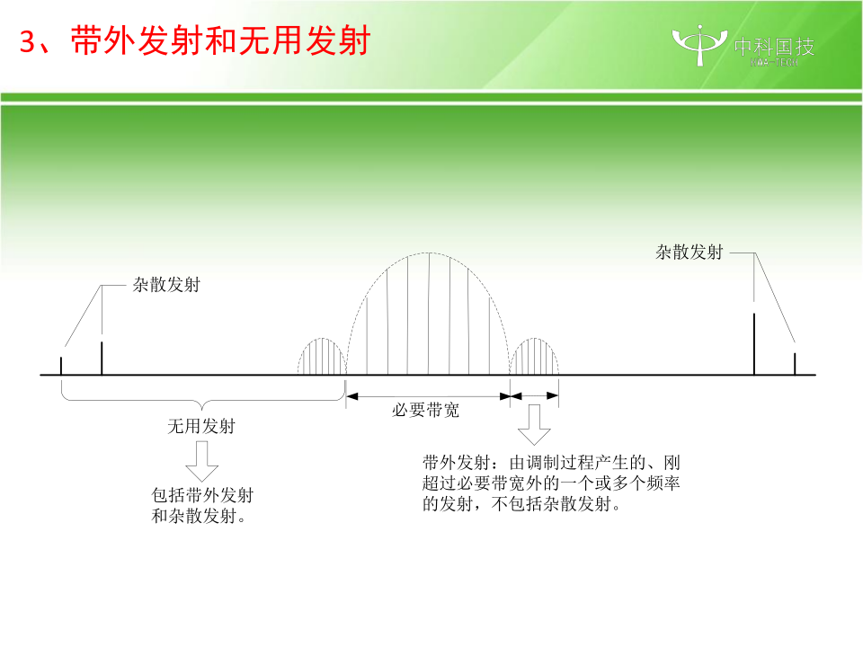
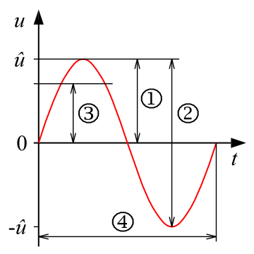
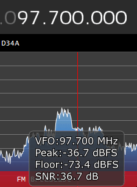
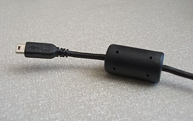
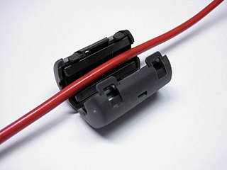
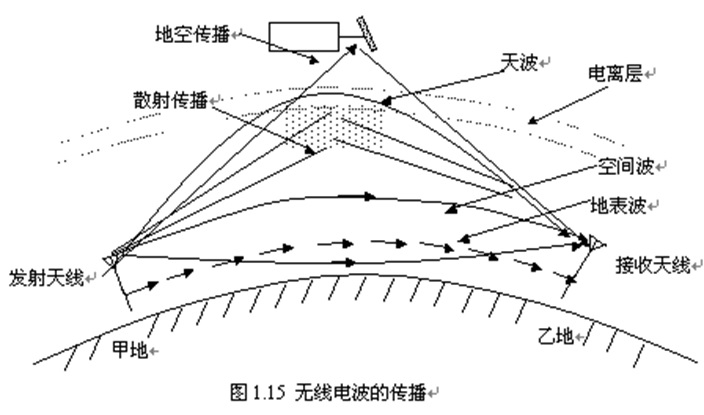
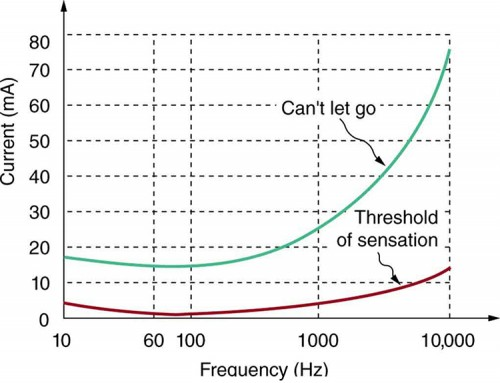

本文GitHub地址是<https://github.com/jks-liu/zhihu/blob/master/ham-license-type-a.md>。

本文力求用最简单的语言，详细介绍你需要掌握的所有内容。让你既知其然，又知其所以然。

最后更新时间：2022年3月8日

注意新版题库v20211022已经更新，本文会稍后更新到新版，敬请期待。题库下载地址<http://www.crac.org.cn/News/List?type=6&y=>，你也可以在下面提到了「智谱APP」中练习。

版本日志：
- 2020年某月某日：初版
- 2021年4月21日：修订版
- 2022年3月8日：提示更新到新版题库。
- 2023年10月21日：根据最新版题库（v20211022）更新，题库具体的变更内容我在[GitHub做了详细的整理](https://github.com/jks-liu/zhihu/tree/master/resource/ham-quiz-bank/diff-20171031-20211022)。

## 简介

本人这个月13号考试，下图是我的准考证。由于本人接触这个领域也不久，下文有何不妥之处，还望指出。最新消息，考试已过。虽然没有具体的分数，但应该是满分。所以我相信，每一个把这个教程看两遍（实指）的人都可以高分通过。

现在几乎所有地区都可以手机APP报名。APP的名字叫“智谱”。APP中点击下面的“特别入口”，选择“业余无线电”-“业余无线电爱好者”，点“进入”再选择“考试报名”就可以了。

友情提示：请携带2B铅笔，上海目前（2020年）还是笔试，很多其它地区已经改为了机试。我考试的时候有一半的人都没带2B铅笔，临时去买的（也包括我）。

简单来说，想要合法地操作业余无线电设备，需要以下几个步骤：

1. 通过考试（也就是本文所覆盖的内容）
2. 购买或自制设备，当然你也可以先买设备再考试  
   淘宝剁手之前注意先到[中国无线电管理网站](http://www.srrc.org.cn/wp_search.aspx)查询即将购买的设备有没有有效期内的核准代码，注意是针对业余业务的核准码。
3. 携带设备去指定机构验机。如果你的机器是购买的并且有上条所说的针对业余业务的核准码，可以免检，跳过此步。
4. 申请无线电台许可
5. 申请识别码（呼号），和步骤四同时进行

## 考试介绍

考试分多个等级，新人只能考A类。

A类考试共30道单选题，时间40分钟，对25道（含）以上合格。开考十五分钟可以交卷，一半此时大部分人都会交卷。考完试一般十天内会公布结果。

题目从题库中随机抽取，题库可从[这里][questions]下载。所以题目的第一个选项是正确答案，当然，真正考试的时候会打乱选项。A类题库共361题。

各种资料链接（最后更新于2020年12月1日）：

- [题库以及考试大纲][questions]，这是我们复习的重点
- [这里可以下载到各种法律法规相关文件][laws]
    * 业余无线电台管理办法（工业和信息化部22号令）
      这一部最重要的一部法规，因为几乎里面的每一条都揉到了下面的题库里。建议每个人都读一读。
    * 关于实施《业余无线电台管理办法》若干事项的通知（工信部无[2013]43号）
    * 《关于进一步明确和规范业余无线电台管理有关工作的通知》(工无函[2014]24号)
    * 业余无线电台操作技术能力验证暂行办法（国无协[2013]1号）
    * 关于业余无线电台操作技术能力考核有关事项的通知（国无协[2013]2号）
    * 《来访者业余无线电台临时操作证书》申请办法（国无协[2013]3号）
    * 关于修订各类别业余无线电台操作技术能力验证考核暂行标准的通知（国无协〔2018〕13号）
- [《中华人民共和国无线电频率划分规定》（工业和信息化部46号令）](http://www.srrc.org.cn/article23480.aspx)
  这部法规定义了很多无线电相关的术语，以及很多技术相关的内容。由于很长，也没必要全看，适合做参考。
- [这是一个可以帮你刷题/模拟考试的网站][practise]，这样，你就不用去读无聊的题库文件。

## 教程安排

这里直接按照考试大纲的顺序编写本教程。所以本教程是针对本考试最系统的教程。

凡是题库中出现的知识点（意味着可能会考到），我会着重强调，或将对应的文字**加粗**。注意，这些强调的内容都是题库中的，考试可能会考的内容。不求你会背诵，至少看到选项的时候你会选。

由于这是一个考试指南，所以里面我也会夹杂一些记忆技巧，助你通过考试。

想了解业余无线电其它知识的朋友，推荐童效勇、陈方的《业余无线电手册》，最新版本是第五版。这可能是大部分人的启蒙书籍吧。

# A.1． 无线电管理相关法规

法律法规粗看比较难记，但其有内在的逻辑。运用你的常识和经验，多看几遍，应该不难。

业余无线电的上位是无线电。

无线电管理的最高法律文件是[《中华人民共和国无线电管理条例》](http://www.gov.cn/zhengce/content/2016-11/25/content_5137687.htm)。其立法机关是国务院和中央军委。

记忆要点：无线电关系国家安全，所以需要**军委**共同管辖。

无线电的主管部门是**各级无线电管理机构**。

## A.1.1 业余电台管理体制和政策

业余无线电管理的最高法律文件是[《业余无线电台管理办法》](http://www.gov.cn/flfg/2012-11/08/content_2260255.htm)，其立法机关是大名鼎鼎的**工信部**（工业和信息化部）。**注意**：考试的时候看清楚题干中问的是无线电还是业余无线电。

注：若无特别说明，引用的法条默认出自《业余无线电台管理办法》。再次强调，我**加粗**的，都是考试可能考的。

第三条 **国家无线电管理机构和省、自治区、直辖市无线电管理机构**（以下简称**地方无线电管理机构**）依法对业余无线电台实施监督管理。
**国家无线电管理机构和地方无线电管理机构**统称无线电管理机构。

考试会问你业余无线电的监管部门，当然你可以说是各级无线电管理机构。题库的答案是**国家无线电管理机构和地方无线电管理机构**，当然啦，是一个意思。对于一个问题，答案经常会有各种不同的说法，我尽量将题库中的答案选项直接呈现给你，以求混个眼熟，毕竟通过考试是我们很重要的一个目的。考试还会问你地方无线电管理机构指的是什么，显然从上面法条可知是**省、自治区、直辖市无线电管理机构**。

第四条（第三款） 依法设置的业余无线电台受国家法律保护。

## A.1.2 业余无线电的相关定义

我国对无线电管理术语 **“业余业务”、“卫星业余业务”和“业余无线电台”** 做出具体定义的法规文件是[**《中华人民共和国无线电频率划分规定》**](http://www.srrc.org.cn/article23480.aspx)。

    - 业余业务 amateur service：供业余无线电爱好者进行自我训练、相互通信和技术研究的无线电通信业务。业余无线电爱好者系指经正式批准的、对无线电技术有兴趣的人，其兴趣纯系个人爱好而不涉及谋取利润。
    - 卫星业余业务 amateur-satellite service：利用地球卫星上的空间电台开展与业余业务相同目的的无线电通信业务。
    - 业余电台 amateur station：用于业余业务的电台。

强调业余无线电爱好者系指**经正式批准（有证）** 的、对无线电技术有兴趣的人，其兴趣纯系个人爱好而不涉及谋取利润。

## A.1.3 无线电管制

无线电管制是指**在特定时间**和**特定区域内**依法采取的对**无线电波的发射、辐射和传播实施的强制性管理**。管理措施包括：
- **限制或者禁止业余无线电台（站）的使用**
- **对特定的无线电频率实施技术阻断**

决定实施无线电管制的机构为
- **在全国范围内或者跨省、自治区、直辖市实施，由国务院和中央军事委员会决定**
- **在省、自治区、直辖市范围内实施，由省、自治区、直辖市人民政府和相关军区决定**

违反无线电管制命令和无线电管制指令的由**国家无线电管理机构或者省、自治区、直辖市无线电管理机构**；违反治安管理规定者由**公安机关**处罚。处罚包括（需要记忆）：
- 责令改正；拒不改正的，关闭、查封、暂扣或者拆除相关设备；情节严重的，吊销电台执照；违反治安管理规定的，由公安机关处罚
- 警告、查封或者没收设备、没收非法所得；情节严重的，可以并处一千元以上，五千元以下的罚款
- 责令限期改正，可以处警告或者三万元以下的罚款

注意：关于处罚的只有上面三个是正确选项。具体的对应关系如下，只为应付考试的话可不用记忆：

- 责令改正；拒不改正的，关闭、查封、暂扣或者拆除相关设备；情节严重的，吊销电台执照；违反治安管理规定的，由公安机关处罚
  * 业余电台违反无线电管制命令和无线电管制指令的
- 警告、查封或者没收设备、没收非法所得；情节严重的，可以并处一千元以上，五千元以下的罚款
  * 对擅自设置、使用业余无线电台的单位或个人
  * 业余电台干扰无线电业务的
  * 业余电台随意变更核定项目、发送和接收与业余无线电无关的信号的
- 责令限期改正，可以处警告或者三万元以下的罚款
  * 超出核定范围使用频率或者有其他违反频率管理有关规定的行为的
  * 对涂改、仿制、伪造、倒卖、出租、出借业余无线电台执照，或者以其他形式非法转让业余无线电台执照的
  * 对盗用、出租、出借、转让、私自编制或者违法使用业余无线电台呼号的
  * 对以不正当手段取得业余无线电台执照的
  * 对向负责监督检查的无线电管理机构隐瞒有关情况、提供虚假材料或者拒绝提供反映其活动情况的真实材料的
  * 对违法使用业余无线电台造成严重后果的

## A.1.4 业余电台的分类管理

不同类别业余无线电台的主要区别在于允许发射的**频率范围**和**最大发射功率**。
- A类业余无线电台允许发射的发射频率为**30-3000MHz**范围内的各业余业务和卫星业余业务频段。
- A类业余无线电台允许发射的最大发射功率为不大于**25瓦**。

业余无线电台**专用无线电发射设备**的重要特征是**发射频率不得超出业余频段**。

## A.1.5 设置业余电台应具备的条件

第六条 申请设置业余无线电台，应当具备下列条件：  
- （一）熟悉无线电管理规定；
- （二）具备国家无线电管理机构规定的操作技术能力；
- （三）无线电发射设备符合国家相关技术标准；
- （四）法律、行政法规规定的其他条件。
- 单位申请设置业余无线电台的，其业余无线电台负责人应当具备前款第一项规定的条件，技术负责人应当具备前款第一项和第二项规定的条件。
- 个人申请设置具有发信功能的业余无线电台的，应当年满十八周岁。 

申请设置业余无线电台应当具备的条件有：

- 熟悉无线电管理规定
- **具备国家规定的操作技术能力**  
  注意这个能力标准是国家设定的，**不是考试机构设定的**  
  具备能力的标志为：**取得《业余无线电台操作证书》**，即想要设台，自己得是**业余无线电爱好者（有证）**，但可以是正在起步的（有证）初学者
- **发射设备符合国家技术标准**
- 法律和行政法规规定的其他条件  
  其它机构（包括当地无线电管理机构委托的受理机构）不得设置其它条件
- **不需要**加入指定协会。

个人申请设置具有发信功能的业余无线电台的年龄条件是**年满十八周岁**。具备《业余无线电台操作证书》者**操作业余无线电台不受年龄限制**。

这意味着（不满十八周岁的）中小学生可以考取《业余无线电台操作证书》并独立操作具有发信功能业余无线电台，但不能申请设置属于自己的电台，只能使用别人的。

## A.1.6 使用业余电台应具备的条件

个人申请设置具有发信功能的业余无线电台的年龄条件是**年满十八周岁**。具备《业余无线电台操作证书》者**操作业余无线电台不受年龄限制**。熟悉无线电管理规定、具备国家规定的操作技术能力并取得相应操作技术能力证明就可以使用业余无线电台。

## A.1.7 业余电台操作证书

**国家无线电管理机构和地方无线电管理机构（或其委托单位）** 负责组织A类和B类业余无线电台所需操作技术能力的验证。

注意“业余无线电台操作证书”的颁发机构是**中国无线电协会**，不是中国无线电运动协会，也不是地方无线电协会。

## A.1.8 设置业余电台的申请流程

第四条（第一款） 设置业余无线电台，应当**按照本办法的规定办理审批手续，取得业余无线电台执照**。  
第四条规定了设置业余电台的**必要步骤**。

按照《业余电台管理办法》规定，申请设置使用配备有多台业余无线电发射设备的业余无线电台，应该**视为一个业余电台，指配一个电台呼号，但所有设备均应经过核定并将参数载入电台执照**。

个人申请设置业余无线电台应当提交的书面材料为：
- **两种表格**（具体的表格名称可以不记）
  * （一）《业余无线电台设置（变更）申请表》；
  * （二）《业余无线电台技术资料申报表》；
- **身份证和操作证书的原件、复印件**

申请设置**中继台、信标台、空间台和技术参数需要超出管理办法规定的特殊业余电台**时，在《业余无线电台设置（变更）申请表》 的“台站种类”应选择 **“特殊”** 类。申请设置此类特殊业余电台**由地方无线电管理机构受理和初审后交国家无线电管理机构审批**。

负责受理设置业余无线电台**申请**的机构为**设台地地方无线电管理机构或其正式委托的代理受理服务机构**。**审批**机构为
- 设置在省、自治区、直辖市范围内通信的业余无线电台，**审批**机构为**设台地的地方无线电管理机构**；
- 设置通信范围涉及两个以上的省、自治区、直辖市或者涉及境外的一般业余无线电台，**审批**机构为**国家无线电管理机构或其委托的设台地的地方无线电管理机构**。

## A.1.9 业余电台执照核定项目的变更、业余电台的注销

按照在省、自治区、直辖市范围内通信所申请设置的业余无线电台，如想要将通信范围扩大至涉及两个以上的省、自治区、直辖市或者涉及境外，或者要到设台地以外进行异地发射操作，须办理下列手续：**事先向核发执照的无线电管理机构申请办理变更手续，按相关流程经国家无线电管理机构或其委托的设台地的地方无线电管理机构批准后，换发业余无线电台执照**。

业余无线电台执照有效期届满后需要继续使用的，应当在**有效期届满一个月前**内向核发执照的无线电管理机构申请办理延续手续。**注意，上面这个说法是不对的**，只是题库里是这么写的，所以为了考试的目的我记在这里。这个问题题库里还有另一个选项：有效期届满一个月之内，我看不出来这两个说法有什么不同。这里我列出法律原文《业余无线电台管理办法》

    第十三条　业余无线电台执照由国家无线电管理机构统一印制。
    业余无线电台执照的有效期不超过五年。业余无线电台执照有效期届满后需要继续使用的，应当在有效期届满前三十日以前向核发执照的无线电管理机构申请办理延续手续。

从这里可以看到有两个问题：
- 一个是**届满**，一个是**届满前**，意义完全不同
- 三十日和一个月，算是不严谨吧

所以，比如你的执照是五月五号到期，那你应该在四月五号前办理延续手续。

因改进或调整业余发射设备使业余无线电台的技术参数超出其业余无线电台执照所核定的范围时应**及时向核发执照的无线电管理机构申请办理变更手续，换发业余无线电台执照**。

终止使用业余无线电台的，应当向**核发业余无线电台执照的无线电管理机构**申请注销执照。

- 经**地方无线电管理机构**批准设置的业余无线电台，设台地迁入其他省、自治区或者直辖市时，应当**先到原核发执照的无线电管理机构办理申请注销原业余无线电台，再到迁入地的地方无线电管理机构办理申请设置业余无线电台的手续**。
- 经**国家无线电管理机构**批准设置的业余无线电台，设台地迁入其他省、自治区或者直辖市时，应当**先到原核发执照的无线电管理机构申请办理注销手续，缴回原电台执照，领取国家无线电管理机构已批准设台的证明，凭证明到迁入地的地方无线电管理机构完成申请变更手续，领取新电台执照**。

## A.1.10 关于业余电台发射设备的规定

业余无线电发射设备的**频率容限**和**杂散域发射功率/杂散发射最大允许功率电平**必须符合国家的相关规定。具体要求见《中华人民共和国无线电频率划分规定》的附录1和2。一般用**百万分之几或者赫兹**表示，注意是百万。杂散域发射功率通常使用下述单位表示：**绝对功率dBm、低于载波发射功率的分贝值dBc、低于PEP发射功率的相对值dB**。

- **分贝毫瓦 dBm** （decibel relative to one milliwatt）是以一毫瓦为基准的功率绝对值  
  如果功率为P毫瓦（mW），转换成dBm为：  
  $$x=10\log_{{10}}(P/(1\ {\mathrm {mW}}))$$  
  反过来，如果功率是x dBm，则
  $$P=(1\ {\mathrm  {mW}})10^{{(x/10)}}\,$$
- dBc和dBm是类似的，只不过基准不是1 mW，而是载波（Carrier）功率，所以是一个相对值单位。
- “PEP”是指供给天线传输线的峰包功率，使用单位：W。（《中华人民共和国无线电频率划分规定》，[《杂散域的无用发射》](https://www.itu.int/dms_pubrec/itu-r/rec/sm/R-REC-SM.329-11-201101-S!!PDF-C.pdf)）。那低于PEP发射功率的相对值dB就很好理解了。

记得**分贝毫瓦（dBm）**依次类推还有**dBμ**，考试是会考的，当然不考公式，会给你一个值，让你转换另一个值。
- 0.1 mW = -10 dBm
- 1 mW = 0 dBm
- 10 mW = 10 dBm
- 100 mW = 20 dBm
- 1W = 30 dBm
- 10W = 40 dBm

灵活运用上面的公式。比如，问你5W是多少，显然应该是30到40之间的一个数，就选那个就行。

对于dBμ，就是以1 μW为标准的功率绝对值。如果你搞不懂上面的公式，就记住下面一点：
$$x\ dBm = (x+30)\ dBμ$$
比如
$$10\ dBm = 40\ dBμ$$
然后看到dBμ，就先转换为dBm在进行计算。

比如，0.25W，换算成dBm，应该是20到30间的一个数。那换算成dBμ，就加上30，应该是50到60间的一个数。

有时候有两个选项符合要求，需要计算。如果你不想计算，记得**不要选择**结尾是5的那个选项，什么25、35、45都不要选，剩下的那个就是正确答案。

依次类推还有**dBW**，如果你不想计算，记得一点，题库里的dBW都不是正确答案。
$$x\ dBm = (x-30)\ dBW$$

- 指配频率 assigned frequency  
  指配给一个电台的频段的中心频率。
- 频率容限 frequency tolerance  
  发射所占频段的中心频率偏离指配频率，或发射的特征频率偏离参考频率的最大容许偏差。  

- 杂散发射 spurious emission  
  必要带宽之外的一个或多个频率的发射，其发射电平可降低而不致影响相应信息的传输。杂散发射包括谐波发射、寄生发射、互调产物及变频产物，但带外发射除外。
- 带外发射 out-of-band emission  
  由于调制过程而产生的、刚超出必要带宽的一个或多个频率的发射，但杂散发射除外。
- 无用发射 unwanted emissions  
  包括杂散发射和带外发射。
- （发射的）带外域 out-of-band domain（of an emission）  
  是指刚超出必要带宽而未进入杂散域的频率范围，在此频率范围内带外发射为其主要发射产物。基于产生的源而定义的带外发射，主要产生在此带外域中，也会在杂散域中延伸一小部分。同样地，主要产生在杂散域中的杂散发射也可能在带外域中产生。
- （发射的）杂散域 spurious domain（of an emission）  
  带外域以外的频率范围，在此频率范围内杂散发射为其主要发射产物。
- 杂散域发射功率通常用发射机连接天馈线的输出端的杂散发射频率的峰包功率或平均功率表示，其参考测量带宽主要取决于发射机的无线业务种类。杂散域发射功率也可以用电场强度或地球表面功率通量密度（pfd）等效表示。

图片来自聂杏春的[无线电设备杂散发射技术要求和测量方法](http://www.cesi.cn/uploads/soft/120830/25-120S0092528.pdf)，版权归原作者所有。

比如一台发射机，工作频率为145.000MHz，但在435.000MHz的频率上也有发射，显然从上图可知属于杂散发射。

业余无线电台使用的发射设备必须符合下列条件
- **商品设备应当具备《无线电发射设备型号核准证》**  
  型号核准的法律依据为 **《无线电频率划分规定》中有关无线电发射设备技术指标的规定**  
- 自制、改装、拼装设备应通过国家相关技术标准的检测

业余无线电台专用无线电发射设备的发射频率必须满足**发射频率不能超越业余业务或者卫星业余业务频段**，不需要包含所有业余业务或者卫星业余业务频段。

所以总结一下对发射设备的要求：
- **频率容限不超过限值**
- **杂散辐射不超过限值**
- **发射频率不超出国家规定的业余频率**

## A.1.11 无线电频率的管理

A类业余无线电台允许发射的发射频率为**30-3000MHz**范围内的各业余业务和卫星业余业务频段。

- HF（高频） **3-30**MHz
- VHF（甚高频） **30-300**MHz
- UHF（特高频） **300-3000**MHz
  * **家用微波炉**一般工作在这个频带

**《中华人民共和国无线电频率划分规定》** 规定了业余无线电台使用的频率。[《中华人民共和国民法典》](http://www.npc.gov.cn/npc/c30834/202006/75ba6483b8344591abd07917e1d25cc8.shtml)将于2021年正式生效，《物权法》将同时废止。**《中华人民共和国民法典》**第二百五十二条：无线电频谱资源属于国家所有。

注意上表中的单位。

[//]: # Mark

专用的频段（需要记忆），即上表粉色 Mark
- 7MHz
- 14MHz
- 21MHz
- 28MHz
- 47GHz （这个上表中没有）

[//]: #Mark

我国分配给业余业务和卫星业余业务与其他业务共用、并且业余业务和卫星业余业务作为**主要业务**的频段（上表黄色）有（考试只要记得以下VHF和UHF的频段，实际上只有VHF频段）：Mark
- 50MHz，6米业余波段，50-54MHz
- 144MHz，2米业余波段，下面几个细节也要记得哟
  * 144-146MHz为唯一主要业务
  * 146-148MHz为与其他业务共同作为主要业务
  * 电台在144MHz频段进行本地联络时应避免占用144-144.035MHz和145.8-146MHz
  * 145.8MHz至146MHz业余频段留给业余卫星通信使用，话音及其他通信方式不应占用

144-144.035MHz频段我没有找到相关法律法规的明确规定。根据这份[BAND PLAN](https://www.qsl.net/yu1bbv/ra_medija/ra_pravila/Band_plan.pdf)，这个频段被用于月球面反射通信（EME，Earth–Moon–Earth communication）。

[//]: # Mark TODO

分配给业余业务和卫星业余业务与其他业务共用、并且业余业务和卫星业余业务作为**唯一主要业务**的频段的个数为**3个**。在3GHz以下的该类频段为**144-146**MHz。

[//]: # Mark TODO

我国分配给业余业务和卫星业余业务与其他业务共用、并且业余业务和卫星业余业务作为**次要业务**的1200MHz以下频段有（需要记忆），上表绿色
- 135.7kHz（这个上表中没有）
- 10.1MHz
- 430MHz，0.7米业余波段，430-440MHz，次要业务
  * 这个频段中我国分配的主要业务是“无线电定位和航空无线电导航”。
  * 在430MHz频段进行本地联络时应避免占用431.9-432.240MHz和435-438MHz
  * 435MHz至438MHz业余频段留给业余卫星通信使用，话音及其他通信方式不应占用

431.9-432.240MHz频段，根据这份[India National Spectrum Plan (INSP) for Amateur Radio Service](https://web.archive.org/web/20210427140500/https://s2p.studylib.net/store/data/018368280.pdf?k=EwAAAXkTo224AAACWCQJih6PEtzw7KzTCM07rqeGteJzEKPp9zsApEPf53ER)，也是用于EME通信。

业余无线电台在业余业务、卫星业余业务作为次要业务使用的频率或者与其他主要业务共同使用的频率上发射操作时，应当**遵守无线电管理机构对该频率的使用规定**。**业余无线电台在无线电管理机构核准其使用的频段内，享有平等的频率使用权**。

**划分、分配、指配**，请熟记下列定义
- （频段的）划分：allocation（of a frequency band）  
  由国家将某个特定的频带列入频率划分表，规定该频带可在指定的条件下供业余业余业务或者卫星业余业务使用
- （无线电频率或无线电频道的）分配：allotment（of a radio frequency or radio frequency channel）  
  将无线电频率或频道规定由一个或多个部门，在指定的区域内供地面或空间无线电通信业务在指定条件下使用
- （无线电频率或无线电频道的）指配：assignment（of a radio frequency or radio frequency channel）  
  将无线电频率或频道批准给具体的业余无线电台在规定条件下使用

上面几个概念有点绕，准确注意对象可帮助记忆
- 划分业务（频率）
- 分配（频率）给地区、国家或部门
- 指配（频率）给电台

在频率划分表中，一个频带被标明划分给多种业务时，这些业务被分为**主要业务**和**次要业务**。

《中华人民共和国无线电频率划分规定》3.2.1（3）规定：（下面三条需要记忆）
次要业务台站
a) 不得对业经指配或将来可能指配频率的主要业务电台产生有害干扰；  
b) 不得对来自业经指配或将来可能指配频率的主要业务电台的有害干扰提出保护要
求；  
c) 可要求保护不受来自将来可能指配频率的同一业务或其他次要业务电台的有害干
扰。todo typo

## A.1.12 业余电台呼号的管理
### A.1.12.1业余电台呼号的分配和指配

**无线电管理机构核发业余无线电台执照时，同时指配业余无线电台呼号**。如业余无线电爱好者对业已指配给自己的电台呼号不满意，**不可以**申请另行指配业余无线电台呼号。核发业余无线电台执照的无线电管理机构已经为申请人指配业余无线电台呼号的，不另行指配其他业余无线电台呼号。

各地业余无线电台呼号前缀字母和后缀字符的可用范围**由国家无线电管理机构编制和分配**。

业余无线电爱好者**不可以**要求设台地所在地方无线电管理机构给予指配超出业已分配给该地方的前缀字母和后缀字符可用范围的业余无线电台呼号

设台地迁入其他省、自治区或者直辖市时，**设台人可从下面方法中二选一**：
- 方法一，注销原电台呼号，指配迁入地的新电台呼号
- 方法二，申请在迁入地继续指配原来的电台呼号  
  **先到原核发执照的无线电管理机构申请办理注销手续，缴回原电台执照，取得由迁入地指配原业余无线电台呼号的书面同意，再到迁入地的地方无线电管理机构办理相应的手续、重新指配原电台呼号，领取新的电台执照**

### A.1.12.2 业余电台呼号的使用规则

《业余无线电台管理办法》规定业余无线电台按以下办法（需要记忆）设置、正确使用业余无线电台呼号
- 业余无线电台应当在每次通信建立及结束时，主动报出本台呼号
- 在发射过程中至少每十分钟报出本台呼号一次
- 对于通信对方，也应使用对方电台的呼号加以标识
- 这里呼号指完整的电台呼号，如在设台地以外的地点进行异地发射操作，还应在前面加上字母B、操作地分区号和符号“/”。 在实际通信中，**不可以**把本台呼号的地区号码加后缀视作《业余电台管理办法》所说的“本台呼号”。TODO 分区

业余无线电台分区表（考试应该不考）
- 第1区：北京
- 第2区：黑龙江 吉林 辽宁
- 第3区：河北 内蒙古 山西 天津
- 第4区：江苏 山东 上海
- 第5区：福建 江西 浙江
- 第6区：安徽 河南 湖北
- 第7区：广东 广西 海南 湖南
- 第8区：贵州 四川 云南 重庆
- 第9区：甘肃 宁夏 青海 陕西
- 第0区：西藏 新疆 

- 例LK0079：由国家无线电管理机构批准设台的北京火腿的电台呼号为BH1AAA，把电台带到西安去使用，则本台呼号应该为**B9/BH1AAA**。这种操作称为**异地发射操作**。
- 例LK0084：某业余无线电爱好者，自己所设置的业余无线电台呼号为BH1ZZZ。现该爱好者到业余无线电台BH9YYY做客并在该台进行发射操作。应当使用的呼号**BH9YYY或者B9/BH1ZZZ**。这种操作称为**客席发射操作**。
- 例LK0093：BH1ZZZ由北京迁入河北省，并办妥了由河北无线电管理机构指配使用原电台呼号的全部手续，领取了新的业余无线电台执照。该台在日常通信时应使用呼号**B3/BH1ZZZ**。

### A.1.12.3 业余电台迁移时的管理流程及其呼号指配
### A.1.12.4 业余电台操作人员客席操作及其呼号使用
### A.1.12.5 业余电台移动和异地操作及其呼号使用

## A.1.13 业余电台的使用规定
### A.1.13.1 关于业余电台一般通信的规定

业余电台的法定用途为业余无线电爱好者进行**自我训练、相互通信和技术研究**，**严禁用于以下目的**

- 娱乐、闲聊、消遣等
- 机动车辆行车服务性通信
- 普通活动（包括公益活动）的通信工具
- 与个人生活事务有关的通信

第四条（第二款） 国家鼓励和支持业余无线电通信技术的研究、普及和突发重大自然灾害等紧急情况下的应急无线电通信活动。 

- **业余无线电台的通信对象应当限于业余无线电台**，所以以下行为是**错误**的：
  - 某业余电台操作者听到业余专用频率上出现某种显然出自非业余电台的人为干扰发射，于是按下话筒向该发射者宣传无线电管理法规知识
  - 在业余无线电台中转发广播电台、互联网聊天、电话通话、其他电台的联络信号
  - 业余电台在通信中为其他人或者单位、组织转达信息
  - **与公众对讲机通信**
- **未经核发业余无线电台执照的无线电管理机构批准，业余无线电台不得以任何方式进行广播或者发射通播性质的信号**，所以以下行为是**错误**的：
  - 某业余无线电协会在发射操作中向其会员播发公益性通知和技术训练讲座，但未得到相应无线电管理机构的批准
- **不得发送与业余业务和卫星业余业务无关的信号**。
- **严禁利用业余无线电台从事从事商业或者其他营利活动**，所以以下行为是**错误**的
  * 出租车安装业余电台并用来传递有关载客的信息
  * 利用业余无线电台通信来促销业余无线电产品或者推动与业余无线电活动有关的其他商业性活动
- **严禁阻碍其他无线电台通信**

当我说一个行为时**错误**的，意味着这个行为是被**禁止**的，是**违法**的。

**任何时候都应当使用明语及业余无线电领域公认的缩略语和简语**。

业余无线电台实验新的编码、调制方式、数字通信协议或者交换尚未公开格式的数据文件时，应**事先尽可能采取各种办法向信号可能覆盖范围内的业余无线电爱好者公开有关技术细节，并提交给核发其业余无线电台执照的地方无线电管理机构**。

由**国家无线电管理机构审批**的业余无线电台在设台地以外的地点进行**异地发射**操作时，**既要符合业余电台执照所核定的各项参数约束，又要遵守操作所在地的地方无线电管理机构的相关规定**。

具备国家无线电管理机构规定的操作技术能力并具有法律规定有效证明文件、但还没有获准设置自己的业余电台的人**可以**到业余电台进行发射操作。**使用所操作业余电台的呼号，由该业余电台的设台人对操作不妥而造成的有害干负责**。

尚未考得《业余电台操作证书》的人在接受业余电台培训中实习发射操作**必须已接受法规等基础培训、必须由电台负责人现场辅导、必须在执照核定范围以及国家规定的操作权限内、进行短时间体验性发射操作实习**。

业余无线电台设置人**应当确保其无线电发射设备处于正常工作状态，避免对其他无线电业务造成有害干扰**。

业余无线电爱好者**不得接收与业余业务和卫星业余业务无关的信号**。无意接收到非业余业务和卫星业余业务的信息时**不得传播、公布**。

国家**禁止**利用业余无线电台从事发布、传播违反法律或者公共道德的信息的行为。

国际电联规定的确定发射电台辐射功率的原则为**发射电台只应辐射为保证满意服务所必要的功率**。

业余电台通信受到违法电台或者不明电台的有害干扰时，应**不予理睬，收集有关信息并向无线电管理机构举报**。

### A.1.13.2 关于业余无线电应急通信的规定

在突发重大自然灾害等紧急情况下，业余无线电台**才可以和非业余无线电台进行规定内容的通信**。内容限于**与抢险救灾直接相关的紧急事务**或者**应急救援相关部门交办的任务**。

### A.1.13.3 业余无线电中继台管理规定和使用规范

业余中继台的设置和技术参数等应**符合国家以及设台地的地方无线电管理机构的规定**。

业余中继台必须
- **设专人负责监控和管理工作，配备有效的遥控手段，保证造成有害干扰时及时停止发射**。
- **向其覆盖区域内的所有业余无线电台提供平等的服务，并将使用业余中继台所需的各项技术参数公开**

选择144MHz或430MHz业余模拟调频中继台同频段收发频差的原则是**采用业余无线电标准频差，即144MHz频段600kHz，430MHz频段5MHz**。

业余中继台的使用原则是**除必要的短暂通信外，应保持业余中继台具有足够的空闲时间，以便随时响应突发灾害应急呼叫**。

如果你知道另一个电台的呼号，想要在中继上呼叫他，你应该**呼叫对方的呼号，并报出自己的呼号**。

### A.1.13.4 业余电台通联卡片及电台日志

法规和国际业余无线电惯例要求业余电台日志记载的必要基本内容是（英文缩写也要记忆）:
- 通信时间 DATE、TIME
- 通信频率 FREQ
- 通信模式 MODE
- 对方呼号 CALL（对方）
- 双方信号报告 RST（双方）

- 迫切需要方卡回寄卡片时，应直接向对方地址邮寄卡片并附加SASE（self-addressed stamped envelope） TODO
- 不是作为联络或收听证明而交换QSL卡片时，应填上“Eye ball QSO”等有关说明，不应赠送空白卡片 TODO

## A.1.14 业余电台管理执法检查和违法处罚
### A.1.14.1 业余电台管理执法检查

业余无线电台设置、使用人应当接受**无线电管理机构或者其委托单位的监督检查**。

### A.1.14.2 业余电台的违法处罚

[**《中华人民共和国刑法》**](http://www.npc.gov.cn/wxzl/wxzl/2000-12/17/content_4680.htm)第二百八十八条    违反国家规定，擅自设置、使用无线电台（站），或者擅自占用频率，经责令停止使用后拒不停止使用，干扰无线电通讯正常进行，造成严重后果的，处三年以下有期徒刑、拘役或者管制，并处或者单处罚金。

# A.2. 无线电通信程序、方法
## A.2.1业余无线电频率的使用规范

**任何核准的业余电台对频率享有平等的频率使用权**。  
例：某俱乐部约定了一个成员业余电台之间交流技术的网络频率，当遇有其他业余电台按通信惯例要求参加通信时，应无条件欢迎加入。

业余电台在发射调试信号进行发射功率和天线驻波比等检查时必须**先将频率设置到无人使用的空闲频率、偏离常用的热点频率**。

## A.2.2 业余电台通信程序

业余电台在发起呼叫前应**先守听一段时间，确保没有其他电台正在使用频率**。通过守听，没有听到信号还不足以确认频率空闲，因为有时听不到通信双方中的另一方，贸然呼叫会对已有的通信造成干扰。为避免这种情况，应该：**先询问“有人使用频率吗”？确认没有应答方能发起呼叫**。英语表达示例（需要记忆）：
- Is the frequency in use？
- Is any body in the frequency？
- Any body here？

业余电台（以BH1ZZZ为例）用话音发起CQ呼叫的正确格式为：**CQ、CQ、CQ。BH1ZZZ呼叫。Bravo Hotel One Zulu Zulu Zulu呼叫，BH1ZZZ呼叫。听到请回答。**或英文**CQ CQ CQ.This is BH1ZZZ. Bravo Hotel One Zulu Zulu Zulu, BH1ZZZ is calling. I’m standing by.**。

业余电台BH1ZZZ用话音呼叫BH8YYY的正确格式为**BH8YYY、BH8YYY、BH8YYY。BH1ZZZ呼叫。Bravo Hotel One Zulu Zulu Zulu，BH1ZZZ呼叫。听到请回答。**。英文为**Bravo Hotel Eight Yankee Yankee Yankee, Bravo Hotel Eight Yankee Yankee Yankee, Bravo Hotel Eight Yankee Yankee Yankee.This is Bravo Hotel One Zulu Zulu Zulu. Bravo Hotel One Zulu Zulu Zulu, Bravo Hotel One Zulu Zulu Zulu is calling. I’m standing by.**。

BH1ZZZ希望加入两个电台正在通信中的谈话，正确的方法为：**在双方对话的间隙，短暂发射一次“Break in！”或“插入！”，如得到响应，再说明本台呼号 “BH1ZZZ请求插入”，等对方正式表示邀请后，方能加入**。以请求插入的方式加入两个电台正在通信中的谈话，应**确认自己的加入不会影响原通信双方的乐趣**。

业余电台之间进行通信，必须相互正确发送和接收的信息为（记忆）：
- 本台呼号
- 对方呼号
- 信号报告

当一部电台在呼叫CQ时，他的意思是**非特指地呼叫任何一部电台**。

[//]: #Mark
回答一个CQ呼叫时**先报出对方的呼号，再报出自己的呼号**。

如果其他电台报告你在2米波段的信号刚才非常强，但是突然变弱或不可辨，这时你应当**稍稍移动一下自己的位置，有时信号无规律反射造成的多径效应可能导致失真**。

**将一个频率作为一个频道存储在电台中**可以让你快速切换到一个你经常使用的频率。

## A.2.3 业余电台通信常用的缩语和简语

Q简语是一种标准化的三字母通信简略语，因短语开头字母均为“Q”而得名。（加粗的为考试可能会考的，需重点记忆）
- Q简语 	问句含义 	答句含义 TODO mark
- QRA 	你的电台名称是？ 	我的电台名称是...
- QRB 	你台离我台多远？ 	我们相距约为...
- QRG 	我的准确频率是多少？ 	你的准确频率是...
- QRI 	我的音调如何？ 	你的音调是(T1-T9)
- QRJ 	我的信号小吗？ 	你的信号小
- QRK 	我的信号可辨度是多少？ 	你的信号可辨度是(R1-R5)
- QRL 	你忙吗？ 	我正忙
- **QRM 	你受到他台干扰吗？ 	我正受到他台干扰 1.无 2.稍有 3.中等 4.严重 5.极端**
- **QRN 	你受到天电干扰吗？ 	我正受到天电干扰 1.无 2.稍有 3.中等 4.严重 5.极端**
- QRO 	要我增加发信功率吗？ 	请增加发信功率
- QRP 	要我减低发信功率吗？ 	请减低发信功率
- QRQ 	要我发得快些吗？ 	请发快些
- QRS 	要我发得慢些吗？ 	请发慢些
- QRT 	要我停止拍发吗？ 	请停止拍发
- QRU 	你有事吗？ 	无事
- QRV 	你准备好了吗？ 	我已准备好了
- QRW 	需要我转告吗？ 	请转告
- QRX 	要我等多长时间？ 	请等待... ...分钟
- **QRZ 	谁在呼叫我？ 	...KHz/MHz正在呼叫你**
- QSA 	我的信号强度是多少？ 	你的信号强度是...
- QSB 	我的信号有衰落吗？ 	你的信号强度是，1.几乎不能抄收 2.弱 3.还好 4.好 5.很好
- QSD 	我的信号不完整吗? 	你的信号不完整
- **QSL 	你确认收妥／QSL卡片吗？ 	我确认收妥／QSL卡片**
- QSO 	你能否和...直接（或转接）通信？ 	你能和...直接（或转接）通信？
- QSP 	你能中转到...吗？ 	我能中转到...
- QSU 	能在这个频率(或某个频率)回复吗？ 	我将在此频率(或某频率)回复
- QSV 	有天电干扰要我在此频率发一串 V 字吗？ 	请在此频率发一串 V 字
- QSW 	你将在此频率(或某频率)发吗？ 	我将在此频率(或某频率)发
- QSX 	你将在某频率收听吗？ 	我将在某频率收听
- QSY 	要我改用其他频率拍发吗？ 	请改用...KHz/MHz拍发
- QSZ 	要我每组发两遍吗？ 	请每组发两遍
- QTB 	要我查对组数吗？ 	请查对组数
- QTC 	你有几份报要发？ 	我有...份报要发
- **QTH 	你的地理位置是？ 	我的地理位置是...**
- QTR 	你的标准时间是？ 	我的标准时间是... 

[业余无线电常用缩略语](http://www.sara.org.cn/technology/detail9.htm)（加粗的为考试可能会考的，需重点记忆），根据题库又补充了很多 mark
- 缩略语 	原语 	含义
- AA 	ALL AFTER 	在后
- LSN 	LISTEN 	收听
- *AB 	ALL BEFORE 	在前
- N 	NO 	不
- *ABT 	ABOUT 	关于、大约
- NA 	NORTH AMERICA 	北美洲
- ADD 	ADDITION 	增加
- NCS 	NET CONTROL STATION 	网络控制电台
- ADR 	ADDRESS 	地址
- ND 	NOTHING DOING 	无事
- AF 	AFRICA 	非洲
- NR 	NUMBER 	数目
- AHR 	ANOTHER 	其他、另外
- *NW 	NOW 	现在
- AGN 	AGAIN 	再、再一次
- OB 	OLD BOY 	老弟
- AM 	AMPLITUDE MODULATION 	调幅
- OC 	OLD CHAP,OCEANIA 	老伙计，大洋洲
- ANS 	ANSWER 	回答
- **OM 	OLD MAN 	老“火腿”**
- **ANT 	ANTENNA 	天线**
- OP 	OPERATOR 	操作员、报务员
- AS 	ASIA 	亚洲
- OSCAR 	ORBITING SATELLITE CARRYING AMATEUR RADIO 	业余卫星
- BCI 	BROADCAST INTERFERENCE 	广播干扰
- OT 	OLD TIME 	老前辈、老资格
- BCNU 	BE SEEING YOU 	见到你
- POBOX 	POST OFFICE BOX 	邮政信箱
- BGN 	BEGIN 	开始
- PSE 	PLEASE 	请
- BUG 	SEMI-AUTOMATIC KEY 	半自动电键
- PWR 	POWER 	功率
- BURO 	BUREAU 	管理局
- ***R 	ROGER、RECEIVED 	收到了**
- CD 	CRD 	卡片
- **RX、RCVR 	RECEIVER 	接收机**
- *CFM 	CONFIRM 	确认、认为
- **RF RADIO FREQUENCY （各种类型的）无线电波**
- RFI 	RADIO FREQUENCY INTERFERENCE 	无线电干扰
- CLBK 	CALL BOOK 	呼号手册
- **RIG 	STATION EQUPMENT 	电台设备** mark
- CQ 	CALL ANY STATION 	普遍呼叫
- RPRT 	REPORT 	报告
- CRT 	CORRECTION 	改正
- RTTY 	RADIO TELETYPE 	无线电传打字
- *CUAGN 	SEE YOU AGAIN 	再见到你
- SA 	SOUTH AMERICA 	南美洲
- *CUL 	SEE YOU LATER 	再会
- SK 	END 	结束符号
- *CW 	CONTINUOUS WAVE 	等幅报
- SKED 	SCKEDULE 	表格
- CY 	COPY 	抄收
- SN 	SOON 	立即、不久
- *DE 	FROM 	从
- SOS 	SAVE OUR SOULD 	呼救信号
- ***DF 	DIRECTION FINDING 	测向**
- **ARDF Amateur radio direction finding 业余无线电测向**
- SRI 	SORRY 	抱歉
- *DR 	DEAR 	亲爱的
- SSB 	SINGLE SIDE BAND 	单边带
- DX 	LONG DISTANCE 	远距离
- SSTV 	SLOW-SCAN TELEVISION 	慢扫描电视
- EL、ELE 	ANTENNA ELEMENT 	天线单元
- STN 	STATION 	电台
- ES 	AND 	和
- SW 	SHORT WAVE、SWITCH 	短波、开关
- EU 	EUROPE 	欧洲
- SWL 	SHORT WAVE LISTENER 	短波收听台
- FB 	FINE BUSINESS 	良好的
- TEMP 	TEMPERATRE 	温度
- FM 	FREQUENCY MODULATION 	调频
- TMW 	TOMORROW 	明天
- **FREQ、FQ 	FREQUENCY 	频率**
- TNX、TKS 	THANKS 	谢谢
- GA 	GOOD AFTERNOON、GO AHEAD 	下午好、往下发
- T/R 	TRANSMIT/RECEIVE 	收发信
- GB 	GOOD BYE 	再见
- TU 	THANKS YOU 	谢谢你
- GE 	GOOD EVENING 	晚上好
- **TX、XMTR 	TRANSMITTER 	发射机**
- GL 	GOOD LUCK 	好运
- U 	YOU 	你
- GLD 	GLAD 	高兴
- UR 	YOUR，YOUR ARE 	你的、你是
- GM 	GOOD MORNING 	早上好
- UTC 	UNIVERSAL COORDINATED TIME 	世界协调时
- GN 	GOOD NIGHT 	晚安
- VFO 	VARIABLE FREQUENCY OSEILLATOR 	可变频率振荡器
- HAM 	AMATEUR TRANSMITTER 	业余无线电爱好者
- VY 	VERY 	很
- HR 	HERE 	这里
- WW 	WORLD WIDE 	全世界
- HPE 	HOPE 	希望
- **WX 	WEATHER 	天气**
- HW 	HOW 	如何
- **XCVR 	TRANSCEIVER 	收发信机**
- IARU 	INTERNATIONAL AMATEUR RADIO UNIN 	国际业余无线电联盟
- XMAS 	CHRISTMAS 	圣诞节
- ITU 	INTERNATIONAL TELECOMMUNICATION UNIN 	国际电讯联盟
- XTAL 	ORYSTAL 	晶体
- K、KU 	GO AHEAD 	请回答
- XYL 	WIFE 	妻子
- KNW 	KNOW 	知道
- YL 	YOUNG LADY 	小姐、女报务员
- LG 	LONG 	长
- YM 	YOUNGMAN 	青年人（男）
- LIS 	LICENSE 	执照
- **73 	BEST REGARDS 	祝愿，致意**
- **LOG 	LOG BOOK 	电台日记**
- **88 	LOVE AND KISSES 	爱与接吻**
- **GND ground 地线，地面**
- **LED light-emitting diode 发光二极管**
- **LCD Liquid Crystal Display 液晶显示器**

注：带“*”的为普通通信常用缩语

天线缩写（需要记忆）TODO mark
- DP 偶极天线
- GP 垂直接地天线
- BEAM 定向天线
- YAGI 八木天线
- VER 垂直天线

## A.2.4 业余电台通信常用的地理常识

中国在东八区（UTC+8），以为这**比UTC时间快8小时**。UTC时间时1点，那么北京时间就是9点；北京时间是1点，UTC时间就是前一天的下午5点。

[//]: #TODO mark

我国所属的CQ分区是**23、24、27**。

“ITU分区”是IARU的活动计算通信成绩的基础。我国所属的“ITU分区”有：**33、42、43、44、50**。

业余无线电通信梅登海德**网格定位**系统（Maidenhead Grid Square Locator）是一种：**根据经纬度坐标对地球表面进行网格划分和命名，用以标示地理位置的系统**。其格式为
- **2个字母和2位数字**，或
- **2个字母和2位数字再加2个字母**  
**两者网格大小不同，4字符网格为经度2度和纬度1度，6字符网格为经度5分和纬度2.5分**。

# A.3.无线电系统原理
## A.3.1 一般常识

辐射（radiation）是指**任何源**的能量流以**无线电波**的形式向外发出，包括闪电产生的电磁波。**不包括**导线中的各种信号/干扰，电场，磁场。

发射（emission）是指：由**无线电发信电台**产生的辐射或辐射产物。发射必须是无线电台，其它的电子设备，闪电等等都不能发射。

电流的单位是**安（培）、A**。电压的单位是**伏（特）、V**。电阻的单位是**欧（姆）、Ω**。**功率**（电能消耗的速率）的单位是**瓦（特）、W**。

[国际单位制词头](https://zh.wikipedia.org/wiki/%E5%9B%BD%E9%99%85%E5%8D%95%E4%BD%8D%E5%88%B6%E8%AF%8D%E5%A4%B4)的符号（加粗的是可能考的，全都是粗的，😂）
- **T $10^{12}$**
- **G $10^{9}$**
- **M $10^{6}$**
- **k $10^{3}$**
- **m $10^{-3}$**
- **µ $10^{-6}$**
- **n $10^{-9}$**
- **p $10^{-12}$**

注意上面大写的M和小写的m是不一样的。

音频所指的频率范围大致是**16Hz - 20kHz**。

## A.3.2 直流电路

只向一个方向流动的电流叫做**直流**。

电源两端电压的方向为**从电源的正极到负极**。电源（或信号源）内阻**使其实际输出电压降低**。

直流电路欧姆定律是说**流过电阻的电流I，与两端的电压U成正比，与阻值R成反比**。
$$I = \frac{U}{R}$$

## A.3.3 交流电路

如上图所示的正弦交流电
1. 峰值 Peak, also amplitude
2. 峰-峰值 Peak-to-peak
3. 有效值 Effective value  
   约为峰值的**70.7%**  
   平常我们说的220V就是有效值
4. 周期 Period

正弦交流电的**平均值为0**.

交流电**频率**为其每秒改变方向的次数，值为$\frac{1}{Period}$。

相位差通常用来描述两个或多个**同频率**正弦信号之间的**时间滞后或超前**关系。

## A.3.4 电子元件及单元电路常识

电阻元件的“额定功率”参数是指该元件正常工作时所能承受的**最大功率**。

一般**金属**是导体，**玻璃，木材，橡胶**是绝缘体。

## A.3.5 无线电信号的调制、解调和频谱

[//]: #TODO_mark

用通常的调频方式进行话音通信，必要带宽约为**6.25kHz**。

## A.3.6 数字信号处理基础常识

**简单正弦波**只包含**一个**频率分量。
$$x = sin(\omega{}t+\phi)$$

**单个无限窄脉冲**（数学上我们称其为[狄拉克δ函数](https://zh.wikipedia.org/wiki/%E7%8B%84%E6%8B%89%E5%85%8B%CE%B4%E5%87%BD%E6%95%B0#%E5%82%85%E9%87%8C%E8%91%89%E8%AE%8A%E6%8F%9B)）在整个频谱内具有**连续的均匀频率分量**（其频谱也称为均匀谱或白色谱）。这个理解不了也没关系，记住我标粗的地方就行。
$$\delta(x) = \begin{cases} +\infty, & x = 0 \\ 0, & x \ne 0 \end{cases}且\int_{-\infty}^\infty \delta(x) \, dx = 1$$

包含多个频率分量的信号通过**滤波器**会发生**频率失真**。

## A.3.7 业余无线电发射和接收设备原理和实用知识

**符合国家或国际上规定的干扰允许值**和**共用标准的干扰**不属于有害干扰。

可以组成完整无线电接收系统的功能部件组合是**接收天线、解调器、输出部件**。可以组成完整无线电发信系统的功能部件组合是**射频振荡器、调制器、发射天线**。

调制是以原始信号控制射频信号的**幅度**（Amplitude）、**频率**（Frequency）或**相位参数**（Phase）。我们分别称其为**幅度调制（调幅AM）、频率调制（调频FM）、相位调制（调相PM）**，缩写需要记忆。

[//]: #TODO_mark

一个FM话音信号在频谱仪上显示为**一条固定的垂直线，左右伴随一组对称的随语音出现和变化的垂直线**。下面的gif是我录制的某电台频谱。特点是对称。

所以，**频谱图**最容易用来表达和解释模拟FM调制原理。对调频信号进行解调的过程称为**鉴频**。

下面介绍FM的两个概念，**带宽**和**频偏**
- 对于给定的FM发射设备，所传输信号的**最高频率越高**、**幅度越大**，射频输出占用带宽越宽。
- 频偏**只取决于被调制信号的幅度**。

[//]: #TODO_mark
**选择性**表述了接收机区分不同信号的能力。

接收机“过载”通常是指**输入信号过于强大，以致导致机内产生附加干扰**。

[//]: #TODO_mark
- **SSB**常被用于长距离弱信号的VHF或UHF联络。
- **FM**被VHF和UHF业余电台本地通信广泛使用。

常用的电源有两种，一种是开关电源（DC-DC），一种是线性稳压电源（LDO）。开关电源可以做得比变压器直接降压整流的线性电源轻巧是因为**开关电源中变压器的工作频率高得多，可以缩小磁性材料截面和减少线圈匝数**。关键词：工作频率。

## A.3.8 业余无线电常用的功率计算及分贝转换

无线电发射机的效率是指**输出到天线系统的信号功率**与发射机所消耗的**电源功率**之比。业余无线电发射机的效率总是明显低于1。所损耗的那部分能量**绝大部分转化为热量**，**极小部分转化为无用信号的电磁辐射**。

[接收灵敏度](https://support.huawei.com/view/contentview!getFileStream.action?mid=SUPE_DOC&viewNid=EDOC1000062973&nid=EDOC1000062973&partNo=j006&type=htm)是指无线设备正常工作所需的天线口最小信号接收功率。因此**灵敏度指标数值越小，接收最小信号的能力越强**。

[//]: #mark
衰减是指**信号通过信道或电路后功率减少**，衰落是指**信号通过信道或电路后发生幅度随时间而起伏**。

**载波功率**是指无线电发信机在无调制情况下，在一个射频周期内供给天线馈线的平均功率。

[//]: #mark_TODO
**CTCSS**（连续音频编码静噪系统，Continuous Tone-Coded Squelch System）是指调频发射机在发射的语音信号上附加一个人耳听不到的低频音频，用来打开接收机的静噪。记住前面的缩写。其属于模拟亚音频。当然有模拟亚音频，就有数字亚音频，这里就不展开了。
静噪灵敏度是指**能够使静噪电路退出静噪状态的射频信号最小输入电平**。

## A.3.9 业余电台的天馈线系统
### A.3.9.1 天线的基础知识

发射天线的作用是**把无线电发射机输出的射频信号电流转换为空间的电磁波**。接收天线系统的作用是**把空间的有用电磁波转换为射频电压电流信号**。

保证业余无线电通信接收机优良接收能力的主要因素是
- **良好的抗干扰能力**
- **足够高的灵敏度**
- **尽量低的本机噪声和信号失真**

[//]: #mark_TODO
由半波长偶极天线和馈电电缆构成的天馈系统，理想的工作状态是**天线上只有驻波，馈线上只有行波**。

[//]: #mark_TODO
在零仰角附近具有主辐射瓣的垂直接地天线，其振子的长度应为**1/4波长的奇数倍**。

[//]: #TODO_mark
通常把垂直偶极天线或者垂直接地天线称为“全向天线”，是因为**它们在水平方向没有指向性，但在立体空间有方向性**。振子电气长度为1/4波长的垂直接地天线的最大辐射方向为**在水平方向没有指向性，在垂直方向指向水平面**。垂直接地天线（GP）的构造为电气长度为1/4波长的垂直振子加一个“接地”反射体，因其简单而被大量应用于手持和车载业余电台，但这种天线的实际工作情况往往与理论值相差较大，尤其在频率较低的频段。最常见的原因是**缺乏有效的接地反射体**。改善办法是**GP天线必须有足够大的接地反射体来形成振子镜像，否则谐振频率和阻抗都将与理论值有显著偏差，应尽量用大面积金属体与天线的接地端直接连接**。

**在电缆外面套铁氧体磁环**（磁珠）可以减少在音频同轴电缆屏蔽层外皮中的感应射频电流。
 
- [左图](https://zh.wikipedia.org/wiki/File:Cable_end.JPG)作者是英语维基百科的[Stwalkerster](https://en.wikipedia.org/wiki/User:Stwalkerster)，本文件采用知识共享署名-相同方式共享 3.0 未本地化版本许可协议授权。
- [右图](https://zh.wikipedia.org/wiki/File:Ferrite_clamp-on.jpg)作者是[Karl-Martin Skontorp](https://www.flickr.com/photos/21905741@N06)，本文件采用知识共享署名 2.0 通用许可协议授权。

[//]: #TODO_mark
**天线分析仪**可以用来测定天线当前的谐振频率。

[//]: #TODO_mark
直立天线**发射的电磁波电场垂直于地面**。

[//]: #TODO_mark
就大多数手持电台随机附送的“橡皮天线”来说，它的劣势是**相对于全尺寸天线，它的发射和接收效率较低**。

### A.3.9.2 天线的增益

[//]: #TODO_mark
天线增益是指**天线在最大辐射方向上的辐射功率密度与相同条件下基准天线的辐射功率密度之比**。不同基准天线的选择，就有了不同的增益单位。题库里也有以下说法，天线的增益是**相对于参考天线，在某一方向上信号强度的增加**，这里主要强调的是天线的无源现象，由于能量守恒，有一个方向信号增强了，必然就有另一个方向信号减弱了。

[//]: #TODO_mark
各种增益单位：
- dBi：**“相对于无方向性点源天线的增益”，即最大辐射方向上的辐射功率密度与理想点源天线的辐射功率密度之比**
- dBd：**“相对于半波长偶极子天线的增益”，即最大辐射方向上的辐射功率密度与半波长偶极振子的最大辐射功率密度之比**。从这个描述中我们不难推测，dBd是一个比dBi更大的单位。
- dB：**这种表达没有说清楚计算增益所采用的比较基准，缺乏实际意义**。它只能用于计算中表示相对大小，比如你可以说甲信号比乙信号强0.8dB。

[//]: #TODO_mark
由于dB已经是log后的值，所以他们的计算是简单的加减法。dBi与dBd的关系是（下面的公式要背得哟）
$$0\ dBd = 2.15\ dBi$$

例LK0932：比较4.5 dBd和5.85 dBi。解
- $4.5\ dBd = 0\ dBd + 4.5\ dB = 2.15\ dBi + 4.5\ dB = 6.65\ dBi$
- $6.65\ dBi - 5.85\ dBi = 0.8\ dB$
- 所以4.5 dBd比5.85 dBi强0.8 dB

例LK0933：比较2.9dBd和5.85dBi。5.85dBi比2.9dBd强0.8dB，计算留给读者做练习。

### A.3.9.3 天线的极化
### A.3.9.4 馈线基础知识

[//]: #mark_TODO
在为业余电台选购射频电缆作为天线馈线时，最重要的两项电气参数是：
- **特性阻抗**
- **工作频率下单位长度的传输功率损耗**

[//]: #mark_TODO
射频同轴电缆在业余电台中的主要用处是**将无线电信号从发射机传送到天线**。

[//]: #TODO_mark
在业余无线电通信中，“驻波比”通常用来衡量**负载与传输线的匹配质量**。天线与馈线完美匹配时，在驻波表中显示的驻波比是**1:1**。**天线与馈线的连接头接触不良**时，可能导致驻波比不稳定读数。

[//]: #TODO_mark
馈线中的功率损耗会**变成热量**。

[//]: #TODO_mark
使用同轴电缆连接天线时，最好有一个较低的驻波比，因为低驻波比**使能量更有效率地传送，减少损耗**。

[//]: #TODO_mark
**因为同轴电缆使用方便，与周围环境之间的相互影响小**，所以在业余无线电界的使用相对于其他馈线来说更多。

[//]: #TODO_mark
通过同轴电缆的信号频率越高，通常**损耗越高**。

[//]: #TODO_mark_typo
对于400MHz以上的信号，通常会使用的同轴电缆连接器**N型连接器**。

[//]: #TODO_mark
导致同轴电缆损害的最常见的原因是什么**电缆受潮**。因为**紫外线能破坏电缆的外皮，使水分渗入**，所以要求同轴电缆的外皮能抵挡紫外线。和固体电介质同轴电缆相比，空气电介质同轴电缆的劣势是**要采取特别的手段来防止水分进入电缆**。但**空气介质同轴硬电缆**在VHF和UHF频段的损耗最小。

### A.3.9.5 天馈系统的平衡-不平衡转换
### A.3.9.6 天馈系统的阻抗匹配

[//]: #TODO_mark
业余无线电普遍使用的同轴电缆的特性阻抗是**50欧姆**。

## A.3.10 无线电波及其传播
### A.3.10.1 无线电波的基本性质和描述参数

[//]: #mark
无线电波在真空中的速度（即**光速**）299 792 458 米/秒，我们用字母，由于长度单位米时用光速，所以上面的值没有小数点。约为**3x10^8米/秒**。电波在天线导线中的传播速度大约是**真空波速的0.95倍**。常用业余频段的电波在同轴电缆中的传播速度大约是**真空波速的0.65倍**。

### A.3.10.2 无线电波的传播规律、简单计算和常见现象

无线电波按传播方式可主要分为**地面波、天波、空间波、散射波等**。注意虚线上面的实线和下面的实线都是空间波，一个是发射天线直接传给接受天线，一个是经地面反射。而地波（虚线）是沿着地球表面传播，也称地表波。

图片来自[高频电子技术 第 1 章](https://www.slideserve.com/geranium-virgil/1)，版权归原作者所有。

[//]: #TODO_mark
地波的衰减因子取决于**电波频率、地面导电率和传播距离**。

[//]: #TODO_mark
决定超短波视距传播距离极限的主要因素**发射天线和接收天线离地面的相对高度值**。

[//]: #TODO_mark
多径传播对UHF波段或VHF波段数据通信的影响是**可能使误码率增大**。

无线电波在自由空间中的传播路径损耗**与距离的平方成正比，与频率的平方成正比**。

[//]: #TODO
在一个周期内，电磁波走过一定的距离，这个距离叫做**波长**。

无线电波是一种电磁波，所以其两个组成部分是**电场和磁场**。一般我们把在空间中传播的电磁波叫做**无线电波**。

$$c = fλ$$
其中c是光速，f是频率，λ是波长。显然频率和波长成**反比**。如果我们选择**兆赫数（MHz）**，波长选择单位米，则它们的数量关系近似是
$$波长 = \frac{300}{频率}$$

[//]: #TODO_mark
如果你收到了一个从上千公里以外的距离传播过来的VHF信号，最可能的原因是**信号被突发E电离层反射过来**。

## A.3.11 业余无线电工程实践常识

假负载的主要作用是**在测试设备时不让无线电信号真正地发射出去**。

[//]: #TODO_mark
- 收发信机面板上或设置菜单中的符号VOX代表**发信机声控，接入后将根据对话筒有无语音输入的判别自动控制收发转换**
- 收发信机中的PTT是指**按键发射，有信号（一般为对地接通）时发射机由等待转为发射**
- 收发信机中的静噪控制的目的是**在没有信号的情况下，关闭音频输出，使其不会输出噪音**
- 收发信机面板上或设置菜单中的符号SQL代表**静噪控制，检测到接收信号低于一定电平时关断音频输出**
- 有些调频接收机的参数设置菜单有NFM和WFM两种选择。它们的含义是
  * **NFM为窄带调频方式，适用于信道带宽25kHz/12.5kHz的通信信号**
  * **WFM为宽带调频方式，适用于接收信道带宽180kHz左右的广播信号**
  * 在WFM方式的对讲机接收NFM信号，**可以正常听到信号，但声音比较小**
  * 用设置在NFM方式的对讲机接收WFM信号，**可以听到信号，但当调制信号幅度较大、音调较高时会发生明显非线性失真**
- 一些VHF/UHF业余无线电调频手持对讲机或车载台的设置菜单中有“全频偏”和“半频偏”的选择，**分别表示信道间隔为25kHz或者12.5kHz**
- 某些对讲机具有发送DTMF码的功能。缩写DTMF指的是**双音多频编码，由8个音调频率中的两个频率组合成的控制信号，代表16种状态之一，用于遥控和传输数字等简单字符**
- 某些对讲机具有发送CTCSS码的功能。缩写CTCSS指的是**亚音调静噪，即从67-250.3Hz的38个亚音调频率中选取一个作为选通信号，代表38种状态之一，接收机没有收到特定的选通信号时自动关闭音频输出**
- **不能**在FM话音通信时单凭接收机听到对方语音的音量大小来准确判断对方信号的强弱，因为**鉴频输出大小只取决于射频信号的频偏，而且正常信号的幅度会被限幅电路切齐到同样大小**。
- 调频接收机没有接收到信号时，会输出强烈的噪声。关于这种噪声**由天线背景噪声和机内电路噪声的随机频率变化经鉴频形成，其大小与天线接收到的背景噪声幅度无关**，这里的重点是与天线接收到的背景噪声幅度无关
- 如果业余中继台发射机被断断续续的干扰信号所启动，夹杂着不清楚的语音，根据覆盖区内其他业余电台的监听，确定中继台上行频率并没有电台工作。则**可能是中继台附近的两个其他发射机的强信号在中继台上行频率造成了互调干扰**
- **必须反对**业余电台在进行业余卫星通信时使用超过常规要求的发射功率，因为**过强的上行信号会使卫星转发器压低对其他信道的转发功率**
- **直射和经地面反射等多条路径到达的电波相位不同，互相叠加或抵消造成衰落（多径效应）**，因此即使在空旷平地，接收到的本地VHF/UHF信号强度也可能会随着接收位置的移动而发生变化。甚至在相距不远的两点接收同一个远方信号，多径干扰也会造成信号强度发生很大差别，且差别随两点间距离的增大呈周期性变化。
- 如果对方报告你的调频电台发射的信号听起来失真严重、可辨度差，可能的原因是
  * **电台的电源电压不足**
  * **电台所处的位置不好**
  * **电台的发射频率不准确**

- 我们经常使用万用表测量
  * **电压**
  * **电阻**
- **万用电表的电压挡**可大致判断一个干电池是否已经失效
  * 一个新的干电池的标称电压是**1.5伏**
  * 用电压表检查一节干电池两端电压，未使用时测得1.5伏左右，用旧后测得1.2伏左右。但是，**旧干电池的电动势仍然为1.5伏**，只是由于内阻变大导致测量的电压变小。
- **万用电表的电阻挡**可测量一个元件是否短路，显然短路时电阻为0
- **在电阻挡试图测量电压**有可能损坏万用表
- 电压表应**并联**至电路中
- 电流表应**串联**至电路中

[//]: #TODO_mark
劣质开关电源的**开关电路的谐波辐射**会造成对无线电接收机的电磁干扰。

移动车载电台通常使用的电源电压是**约12伏特**。

- **熔断器**可以在电路电流严重过载时保护电路不受损坏
- **整流器**可以把交变电流变成变化的直流
- **变压器**经常被用来把220伏的市电转换成更低电压交流电
- **LED**能够当做指示灯使用
- **欧姆表**被用来测量电阻
- **保险丝**可在过载时切断电路
  * 在需要安装5安培保险丝的地方安装一个20安培的保险丝是不可取的，因为**过大的电流可能导致火灾**

防止设备外壳带电危险的措施包括
- **将所有的交流供电设备全部连接至一个安全地线**
- **安装漏电保护断路器**
- **所有使用交流供电的设备的电源线都使用带有单独保护地线端的三线插头**

- 可充电电池
  * 镍镉电池
  * 铅酸电池
  * 锂离子电池
- 不可充电电池（需要记住）
  * 碱性电池
- **将蓄电池连接与汽车的蓄电池并联，并且发动汽车**可以在电网停电的状况下给一个12伏的铅酸蓄电池充电。
- 铅酸蓄电池的充电和放电进行得过快，**电池可能会过热，甚至释放出可燃气体，甚至可能爆炸**；所以**如果通风不良，会有有爆炸风险的气体聚集的潜在危险**

移动车载台的直流电源负极应当接在**电池的负极或发动机的接地带**。

**无线电测向**可以用来定位无线电噪音源或者恶意干扰源。

# A.4. 与业余无线电台有关的安全防护技术；
## A.4.1 用电安全

安全电压是指不致使人直接致死或致残的电压。标准国家标准GB3805－83《安全电压》，一般环境条件下允许持续接触的“安全特低电压”为**24V**。

上图来自[Electric Hazards and the Human Body](https://courses.lumenlearning.com/physics/chapter/20-6-electric-hazards-and-the-human-body/)，版权归原作者所有。

上图是交流电对人体危害与频率的关系。上面的绿线表示触电电流，下面的红线表示有感觉时的电流。可以看到，当频率在70Hz左右的时候，人体对其最敏感，也就是说最危险；而在高频（包括HF，VHF，UHF）时，危险反而更小。所以，在相同电压有效值时，我们把它们按危险程度由高到低排列是**工频（50 Hz）> 直流 > HF射频 > VHF射频 > UHF射频**。可以这样理解（网上是这么说的，我不保证是对的），工频（50 Hz）由于和心脏的频率比较接近，所以最危险；高频电流直接从人体表面流过，所以伤害较小（但绝不是没有伤害），但**皮肤容易灼伤**。

[//]: #TODO_mark
如遇设备、电线或者电源引起失火，正确的处置为**立即切断电源，使用二氧化碳灭火器灭火**，这里强调二氧化碳灭火器。

必须带电检修由市电供电的无线电设备时，应做到**双脚与地绝缘，单手操作，另一只手不触摸机壳等任何与电路设备有关的金属物品**，这里强调双手不能形成回路。

设备电源拔掉电源线以后**充满高电压的电容器依然可能造成电击**。

自制一台由220伏交流供电的设备，推荐在**交流电源入口火线端串联安装保险丝**。

## A.4.2 防雷知识

防雷装置的作用是防止雷电危害。传统防雷装置的主要组成部分是
- **接闪器（避雷针）**
  * 单支避雷针的保护范围大致**以避雷针为顶点的45度圆锥体以内空间**
- **引下线**
- **接地体**
  * 防雷接地的作用是**把接闪器引入的雷击电流有效地泄入大地**。
  * 对防雷接地基本要求是**要有单独的接地体，接地电阻要小，接闪器到接地体之间的引下线应尽量短而粗**

[//]: #TODO_mark
在为同轴电缆馈线安装避雷器时应当注意**将所有避雷器的地线接到同一个金属板上，然后将这个金属板接到室外的接地极**。

# A.5. 电磁兼容技术以及射频干扰的预防和消除
## A.5.1 电磁辐射防护规定

[//]: #TODO_mark
VHF和UHF信号属于**非电离辐射**。

[//]: #TODO_mark
我国业余电台应该遵守的关于电磁辐射污染的具体管理规定文件为**国家标准GB/T 51391《通信工程建设环境保护技术标准》**。其规定**等效辐射功率在0.1-3MHz不大于300W、在3MHz-300GHz不大于100瓦的无线通信设施（设备）**向没有屏蔽空间发射电磁场可以免于管理。《我国国家标准《电磁环境控制限值》规定公众暴露控制限值中，对环境电磁辐射场强任意连续6分钟内的方均根值要求最严格的频率范围为**30MHz- 3GHz**。由于**人体会对某些特定频率的电磁波吸收量更大**，因此电磁辐射防护规定国家标准中的照射限值随着频率的变化而不同。

## A.5.2 射频干扰的预防和消除

假设中继台的收、发信机共用天线，上下行频率分别为F1和F2。要防止中继台发射机对接收机产生干扰，应在**发信机与天线间串联中心频率为F1的带阻滤波器，在收信机与天线间串接中心频率为F2的带阻滤波器**。这里强调对于中继台而言，上行频率是收信频率（F1），所以收信机要屏蔽发信机的频率（F2）就要串联一个F2的带阻滤波器。

要防止业余HF发射机的杂散发射干扰天线附近的电话机，应该在电话机和电话线之间之间串联**截止频率不高于1MHz的低通滤波器**。这强调要滤除高频（HF）干扰，需要使用低通滤波器。

对天线感兴趣的朋友推荐一本来自美国业余无线电协会的《天线手册》，最新的中文版应该是第二十二版。这是部大块头，适合当参考书，据说90%的人买了后就没看过，谨慎购买。

对讲机的话UV-5R算一代神机，但注意这是部模拟机，好多地方现在都是数字中继，比如上海，买了可能会用不了。大家买对讲机之前最好问问当地的同伴，不用盲目购买。

MMDVM可以方便大家通过网络交流，动手能力强的推荐自己动手做。

[questions]: http://www.crac.org.cn/News/Detail?ID=1862
[laws]: http://www.crac.org.cn/News/Detail?ID=ea3df35318824cf4b956b4bcf6a0b0ab
[practise]: https://www.cqid.cn/
