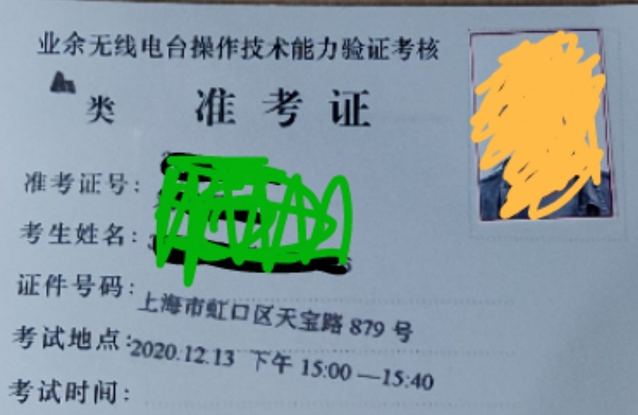
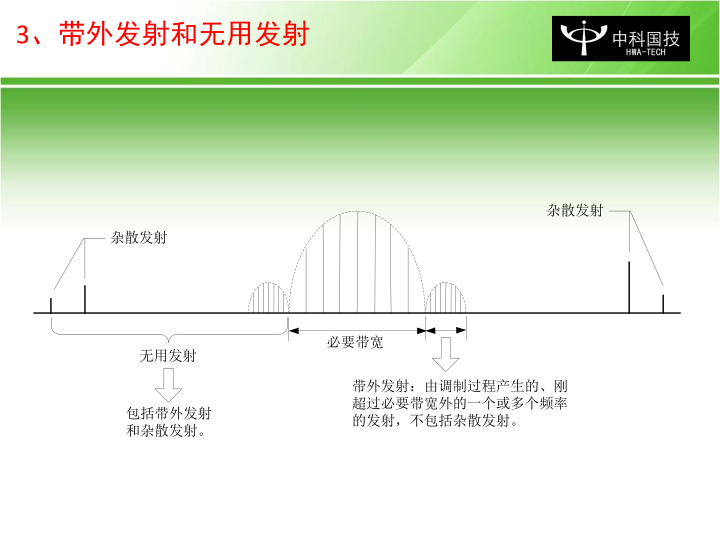
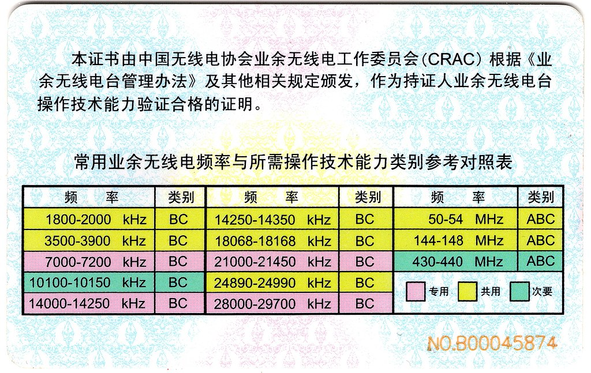
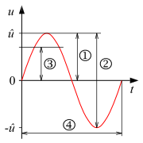

# 业余无线电（HAM）A类操作证考试教程

进度：

本文力求用最简单的语言，详细介绍你需要掌握的所有内容。让你既知其然，又知其所以然。

## 简介

本人这个月13号考试，下图是我的准考证。由于本人接触这个领域也不久，下文有何不妥之处，还望指出。

简单来说，想要合法地操作业余无线电设备，需要以下几个步骤：

1. 通过考试（也就是本文所覆盖的内容）
2. 购买或自制设备
3. 携带设备去指定机构验机，获得呼号

## 考试介绍

考试分多个等级，新人只能考A类。

A类考试共30道单选题，时间40分钟，对25道（含）以上合格。

题目从题库中随机抽取，题库可从[这里][questions]下载。所以题目的第一个选项是正确答案，当然，真正考试的时候会打乱选项。A类题库共361题。

各种资料链接（最后更新于2020年12月1日）：

- [题库以及考试大纲][questions]，这是我们复习的重点
- [这里可以下载到各种法律文件][laws]
    * 业余无线电台管理办法（工业和信息化部22号令）
    * 关于实施《业余无线电台管理办法》若干事项的通知（工信部无[2013]43号）
    * 《关于进一步明确和规范业余无线电台管理有关工作的通知》(工无函[2014]24号)
    * 业余无线电台操作技术能力验证暂行办法（国无协[2013]1号）
    * 关于业余无线电台操作技术能力考核有关事项的通知（国无协[2013]2号）
    * 《来访者业余无线电台临时操作证书》申请办法（国无协[2013]3号）
    * 关于修订各类别业余无线电台操作技术能力验证考核暂行标准的通知（国无协〔2018〕13号）

- [这是一个可以帮你刷题/模拟考试的网站][practise]，这样，你就不用去读无聊的题库文件。

## 教程安排

这里直接按照考试大纲的顺序编写本教程。所以本教程是针对本考试最系统的教程。

凡是题库中出现的知识点（意味着可能会考到），我会着重强调，或将对应的文字**加粗**。

由于这是一个考试指南，所以里面我也会夹杂一些记忆技巧，助你通过考试。

# A.1． 无线电管理相关法规

法律法规粗看比较难记，但其有内在的逻辑。运用你的常识和经验，多看几遍，应该不难。

业余无线电的上位是无线电。下面法规有些说的是无线电，有些说的业余无线电，注意区分。

无线电管理的最高法律文件是[《中华人民共和国无线电管理条例》](http://www.gov.cn/zhengce/content/2016-11/25/content_5137687.htm)。其立法机关是国务院和中央军委。

记忆要点：无线电关系国家安全，所以需要**军委**共同管辖。

## A.1.1 业余电台管理体制和政策

业余无线电管理的最高法律文件是[《业余无线电台管理办法》](http://www.gov.cn/flfg/2012-11/08/content_2260255.htm)，其立法机关是大名鼎鼎的**工信部**（工业和信息化部）。同时**按《业余无线电台管理办法》的规定办理设置审批手续，并取得业余电台执照**是合法设置业余电台的**必要步骤**。依法设置的业余无线电台受国家法律保护。

无线电的管理部门是**各级无线电管理机构**。

业余无线电的监管部门是**国家无线电管理机构和地方无线电管理机构**，这里的地方无线电管理机构指**省、自治区、直辖市无线电管理机构**.

## A.1.2 业余无线电的相关定义

我国对无线电管理术语**“业余业务”、“卫星业余业务”和“业余无线电台”**做出具体定义的法规文件是[**《中华人民共和国无线电频率划分规定》**](http://www.srrc.org.cn/article23480.aspx)。

    - 业余业务 amateur service：供业余无线电爱好者进行自我训练、相互通信和技术研究的无线电通信业务。业余无线电爱好者系指经正式批准的、对无线电技术有兴趣的人，其兴趣纯系个人爱好而不涉及谋取利润。
    - 卫星业余业务 amateur-satellite service：利用地球卫星上的空间电台开展与业余业务相同目的的无线电通信业务。
    - 业余电台 amateur station：用于业余业务的电台。

强调业余无线电爱好者系指**经正式批准（有证）**的、对无线电技术有兴趣的人，其兴趣纯系个人爱好而不涉及谋取利润。

## A.1.3 无线电管制

无线电管制是指**在特定时间**和**特定区域内**依法采取的对**无线电波的发射、辐射和传播实施的强制性管理**。管理措施包括：
- **限制或者禁止业余无线电台（站）的使用**
- **对特定的无线电频率实施技术阻断**

决定实施无线电管制的机构为
- **在全国范围内或者跨省、自治区、直辖市实施，由国务院和中央军事委员会决定**
- **在省、自治区、直辖市范围内实施，由省、自治区、直辖市人民政府和相关军区决定**

违反无线电管制命令和无线电管制指令的由**国家无线电管理机构或者省、自治区、直辖市无线电管理机构**；违反治安管理规定者由**公安机关**处罚。处罚包括（需要记忆）：
- 责令改正
- 拒不改正的，关闭、查封、暂扣或者拆除相关设备
- 情节严重的，吊销电台执照
- 违反治安管理规定的，由公安机关处罚

## A.1.4 业余电台的分类管理

不同类别业余无线电台的主要区别在于允许发射的**频率范围**和**最大发射功率**。
- A类业余无线电台允许发射的发射频率为**30-3000MHz**范围内的各业余业务和卫星业余业务频段。
- A类业余无线电台允许发射的最大发射功率为不大于**25瓦**。

业余无线电台**专用无线电发射设备**的重要特征是**发射频率不得超出业余频段**。

## A.1.5 设置业余电台应具备的条件

个人申请设置具有发信功能的业余无线电台的年龄条件是**年满十八周岁**。具备《业余无线电台操作证书》者**操作业余无线电台不受年龄限制**。

这意味着（不满十八周岁的）中小学生可以考取《业余无线电台操作证书》并独立操作具有发信功能业余无线电台，但不能申请设置属于自己的电台，只能使用别人的。

## A.1.6 使用业余电台应具备的条件

个人申请设置具有发信功能的业余无线电台的年龄条件是**年满十八周岁**。具备《业余无线电台操作证书》者**操作业余无线电台不受年龄限制**。熟悉无线电管理规定、具备国家规定的操作技术能力并取得相应操作技术能力证明就可以使用业余无线电台。

## A.1.7 业余电台操作证书

**国家无线电管理机构和地方无线电管理机构（或其委托单位）** 负责组织A类和B类业余无线电台所需操作技术能力的验证。

注意“业余无线电台操作证书”的颁发机构是**中国无线电协会颁发**，不是中国无线电运动协会。

## A.1.8 设置业余电台的申请流程

申请设置业余无线电台应当具备的条件有：

- 熟悉无线电管理规定
- **具备国家规定的操作技术能力**  
  注意这个能力标准是国家设定的，**不是考试机构设定的**  
  具备能力的标志为：**取得《业余无线电台操作证书》**，即想要设台，自己得是**业余无线电爱好者（有证）**，但可以是正在起步的（有证）初学者
- **发射设备符合国家技术标准**
- 法律和行政法规规定的其他条件  
  其它机构（包括当地无线电管理机构委托的受理机构）不得设置其它条件
- **不需要**加入指定协会。

合法设置业余电台的必要步骤是**按《业余无线电台管理办法》的规定办理设置审批手续，并取得业余电台执照**。

按照《业余电台管理办法》规定，申请设置使用配备有多台业余无线电发射设备的业余无线电台，应该**视为一个业余电台，指配一个电台呼号，但所有设备均应经过核定并将参数载入电台执照**。

个人申请设置业余无线电台应当提交的书面材料为：
- **两种表格** TODO
- **身份证和操作证书的原件、复印件**

申请设置**中继台、信标台、空间台和技术参数需要超出管理办法规定的特殊业余电台**时，在《业余无线电台设置（变更）申请表》 的“台站种类”应选择 **“特殊”** 类。申请设置此类特殊业余电台由**由地方无线电管理机构受理和初审后交国家无线电管理机构审批**。

负责受理设置业余无线电台**申请**的机构为**设台地地方无线电管理机构或其正式委托的代理受理服务机构**。**审批**机构为
- 设置在省、自治区、直辖市范围内通信的业余无线电台，**审批**机构为**设台地的地方无线电管理机构**；
- 设置通信范围涉及两个以上的省、自治区、直辖市或者涉及境外的一般业余无线电台，**审批**机构为**国家无线电管理机构或其委托的设台地的地方无线电管理机构**。

## A.1.9 业余电台执照核定项目的变更、业余电台的注销

按照在省、自治区、直辖市范围内通信所申请设置的业余无线电台，如想要将通信范围扩大至涉及两个以上的省、自治区、直辖市或者涉及境外，或者要到设台地以外进行异地发射操作，须办理下列手续：**事先向核发执照的无线电管理机构申请办理变更手续，按相关流程经国家无线电管理机构或其委托的设台地的地方无线电管理机构批准后，换发业余无线电台执照**。

业余无线电台执照有效期届满后需要继续使用的，应当在**有效期届满一个月前**内向核发执照的无线电管理机构申请办理延续手续。**注意，上面这个说法是不对的**，只是题库里是这么写的，所以为了考试的目的我记在这里。这个问题题库里还有另一个选项：有效期届满一个月之内，我看不出来这两个说法有什么不同。这里我列出法律原文《业余无线电台管理办法》

    第十三条　业余无线电台执照由国家无线电管理机构统一印制。
    业余无线电台执照的有效期不超过五年。业余无线电台执照有效期届满后需要继续使用的，应当在有效期届满前三十日以前向核发执照的无线电管理机构申请办理延续手续。

从这里可以看到有两个问题：
- 一个是**届满**，一个是**届满前**，意义完全不同
- 三十日和一个月，算是不严谨吧

所以，比如你的执照是五月五号到期，那你应该在四月五号前办理延续手续。

因改进或调整业余发射设备使业余无线电台的技术参数超出其业余无线电台执照所核定的范围时应**及时向核发执照的无线电管理机构申请办理变更手续，换发业余无线电台执照**。

终止使用业余无线电台的，应当向**核发业余无线电台执照的无线电管理机构**申请注销执照。

- 经**地方无线电管理机构**批准设置的业余无线电台，设台地迁入其他省、自治区或者直辖市时，应当**先到原核发执照的无线电管理机构办理申请注销原业余无线电台，再到迁入地的地方无线电管理机构办理申请设置业余无线电台的手续**。
- 经**国家无线电管理机构**批准设置的业余无线电台，设台地迁入其他省、自治区或者直辖市时，应当**先到原核发执照的无线电管理机构申请办理注销手续，缴回原电台执照，领取国家无线电管理机构已批准设台的证明，凭证明到迁入地的地方无线电管理机构完成申请变更手续，领取新电台执照**。

## A.1.10 关于业余电台发射设备的规定

业余无线电发射设备的**频率容限**和**杂散域发射功率/杂散发射最大允许功率电平**必须符合国家的相关规定。具体要求见《中华人民共和国无线电频率划分规定》的附录1和2。一般用**百万分之几或者赫兹**表示，注意是百万。杂散域发射功率通常使用下述单位表示：**绝对功率dBm、低于载波发射功率的分贝值dBc、低于PEP发射功率的相对值dB**。

- **分贝毫瓦 dBm** （decibel relative to one milliwatt）是以一毫瓦为基准的功率绝对值  
  如果功率为P毫瓦（mW），转换成dBm为：  
  $$x=10\log_{{10}}(P/(1\ {\mathrm {mW}}))$$  
  反过来，如果功率是x dBm，则
  $$P=(1\ {\mathrm  {mW}})10^{{(x/10)}}\,$$
- dBc和dBm是类似的，只不过基准不是1 mW，而是载波（Carrier）功率，所以是一个相对值单位。
- “PEP”是指供给天线传输线的峰包功率，使用单位：W。（《中华人民共和国无线电频率划分规定》，[《杂散域的无用发射》](https://www.itu.int/dms_pubrec/itu-r/rec/sm/R-REC-SM.329-11-201101-S!!PDF-C.pdf)）。那低于PEP发射功率的相对值dB就很好理解了。

记得**分贝毫瓦（dBm）**依次类推还有**dBμ**，考试是会考的，当然不考公式，会给你一个值，让你转换另一个值。
- 0.1 mW = -10 dBm
- 1 mW = 0 dBm
- 10 mW = 10 dBm
- 100 mW = 20 dBm
- 1W = 30 dBm
- 10W = 40 dBm

灵活运用上面的公式。比如，问你5W是多少，显然应该是30到40之间的一个数，就选那个就行。

对于dBμ，就是以1 μW为标准的功率绝对值。如果你搞不懂上面的公式，就记住下面一点：
$$x\ dBm = (x+30)\ dBμ$$
比如
$$10\ dBm = 40\ dBμ$$
然后看到dBμ，就先转换为dBm在进行计算。

比如，0.25W，换算成dBm，应该是20到30间的一个数。那换算成dBμ，就加上30，应该是50到60间的一个数。

有时候有两个选项符合要求，需要计算。如果你不想计算，记得**不要选择**结尾是5的那个选项，什么25、35、45都不要选，剩下的那个就是正确答案。

依次类推还有**dBW**，如果你不想计算，记得一点，题库里的dBW都不是正确答案。
$$x\ dBm = (x-30)\ dBW$$

- 指配频率 assigned frequency  
  指配给一个电台的频段的中心频率。
- 频率容限 frequency tolerance  
  发射所占频段的中心频率偏离指配频率，或发射的特征频率偏离参考频率的最大容许偏差。  

- 杂散发射 spurious emission  
  必要带宽之外的一个或多个频率的发射，其发射电平可降低而不致影响相应信息的传输。杂散发射包括谐波发射、寄生发射、互调产物及变频产物，但带外发射除外。
- 带外发射 out-of-band emission  
  由于调制过程而产生的、刚超出必要带宽的一个或多个频率的发射，但杂散发射除外。
- 无用发射 unwanted emissions  
  包括杂散发射和带外发射。
- （发射的）带外域 out-of-band domain（of an emission）  
  是指刚超出必要带宽而未进入杂散域的频率范围，在此频率范围内带外发射为其主要发射产物。基于产生的源而定义的带外发射，主要产生在此带外域中，也会在杂散域中延伸一小部分。同样地，主要产生在杂散域中的杂散发射也可能在带外域中产生。
- （发射的）杂散域 spurious domain（of an emission）  
  带外域以外的频率范围，在此频率范围内杂散发射为其主要发射产物。
- 杂散域发射功率通常用发射机连接天馈线的输出端的杂散发射频率的峰包功率或平均功率表示，其参考测量带宽主要取决于发射机的无线业务种类。杂散域发射功率也可以用电场强度或地球表面功率通量密度（pfd）等效表示。

图片来自聂杏春的[无线电设备杂散发射技术要求和测量方法](http://www.cesi.cn/uploads/soft/120830/25-120S0092528.pdf)，版权归原作者所有。

比如一台发射机，工作频率为145.000MHz，但在435.000MHz的频率上也有发射，显然从上图可知属于杂散发射。

业余无线电台使用的发射设备必须符合下列条件
- **商品设备应当具备《无线电发射设备型号核准证》**  
  型号核准的法律依据为 **《无线电频率划分规定》中有关无线电发射设备技术指标的规定**  
  淘宝剁手之前注意先到[中国无线电管理网站](http://www.srrc.org.cn/wp_search.aspx)查询即将购买的设备有没有有效期内的核准代码。虽然没有核准代码的设备据说可以按照自制设备进行检测，但这个我也不懂，请询问你周围懂的朋友。
- 自制、改装、拼装设备应通过国家相关技术标准的检测

业余无线电台专用无线电发射设备的发射频率必须满足**发射频率不能超越业余业务或者卫星业余业务频段**，不需要包含所有业余业务或者卫星业余业务频段。

所以总结一下对发射设备的要求：
- **频率容限不超过限值**
- **杂散辐射不超过限值**
- **发射频率不超出国家规定的业余频率**

## A.1.11 无线电频率的管理

A类业余无线电台允许发射的发射频率为**30-3000MHz**范围内的各业余业务和卫星业余业务频段。

- HF **3-30**MHz
- VHF **30-300**MHz
- UHF **300-3000**MHz

[**《中华人民共和国物权法》**](http://www.gov.cn/flfg/2007-03/19/content_554452.htm)第五十条（第几条就不用记了，只要记住《物权法》就行）规定，无线电频谱资源属于国家所有，所以无线电频率的使用必须得到各级无线电管理机构的批准。**《中华人民共和国无线电频率划分规定》**规定了业余无线电台使用的频率。

注意上表中的单位。

[//]: # Mark

专用的频段（需要记忆），即上表粉色 Mark
- 7MHz
- 14MHz
- 21MHz
- 28MHz
- 47GHz （这个上表中没有）

[//]: #Mark

我国分配给业余业务和卫星业余业务与其他业务共用、并且业余业务和卫星业余业务作为**主要业务**的频段（上表黄色）有（考试只要记得以下VHF和UHF的频段，实际上只有VHF频段）：Mark
- 50MHz，6米业余波段，50-54MHz
- 144MHz，2米业余波段
  * 144-146MHz为唯一主要业务
  * 146-148MHz为与其他业务共同作为主要业务
  * 电台在144MHz频段进行本地联络时应避免占用144-144.035MHz和145.8-146MHz TODO
  * 145.8MHz至146MHz业余频段留给业余卫星通信使用，话音及其他通信方式不应占用

[//]: # Mark TODO

分配给业余业务和卫星业余业务与其他业务共用、并且业余业务和卫星业余业务作为**唯一主要业务**的频段的个数为3个。在3GHz以下的该类频段为**144-146**MHz。

[//]: # Mark TODO

我国分配给业余业务和卫星业余业务与其他业务共用、并且业余业务和卫星业余业务作为**次要业务**的1200MHz以下频段有（需要记忆），上表绿色
- 135.7kHz（这个上表中没有）
- 10.1MHz
- 430MHz，0.7米业余波段，430-440MHz，次要业务
  * 这个频段中我国分配的主要业务是“无线电定位和航空无线电导航”。
  * 在430MHz频段进行本地联络时应避免占用431.9-432.240MHz和435-438MHz TODO
  * 435MHz至438MHz业余频段留给业余卫星通信使用，话音及其他通信方式不应占用

业余无线电台在业余业务、卫星业余业务作为次要业务使用的频率或者与其他主要业务共同使用的频率上发射操作时，应当**遵守无线电管理机构对该频率的使用规定**。**业余无线电台在无线电管理机构核准其使用的频段内，享有平等的频率使用权**。

**划分、分配、指配**，请熟记下列定义
- （频段的）划分：allocation（of a frequency band）  
  由国家将某个特定的频带列入频率划分表，规定该频带可在指定的条件下供业余业余业务或者卫星业余业务使用
- （无线电频率或无线电频道的）分配：allotment（of a radio frequency or radio frequency channel）  
  将无线电频率或频道规定由一个或多个部门，在指定的区域内供地面或空间无线电通信业务在指定条件下使用
- （无线电频率或无线电频道的）指配：assignment（of a radio frequency or radio frequency channel）  
  将无线电频率或频道批准给具体的业余无线电台在规定条件下使用

上面几个概念有点绕，准确注意对象可帮助记忆
- 划分业务（频率）
- 分配（频率）给地区、国家或部门
- 指配（频率）给电台

在频率划分表中，一个频带被标明划分给多种业务时，这些业务被分为**主要业务**和**次要业务**。

《中华人民共和国无线电频率划分规定》3.2.1（3）规定：（下面三条需要记忆）
次要业务台站
a) 不得对业经指配或将来可能指配频率的主要业务电台产生有害干扰；  
b) 不得对来自业经指配或将来可能指配频率的主要业务电台的有害干扰提出保护要
求；  
c) 可要求保护不受来自将来可能指配频率的同一业务或其他次要业务电台的有害干
扰。

## A.1.12 业余电台呼号的管理
### A.1.12.1业余电台呼号的分配和指配

**无线电管理机构核发业余无线电台执照时，同时指配业余无线电台呼号**。如业余无线电爱好者对业已指配给自己的电台呼号不满意，**不可以**申请另行指配业余无线电台呼号。核发业余无线电台执照的无线电管理机构已经为申请人指配业余无线电台呼号的，不另行指配其他业余无线电台呼号。

各地业余无线电台呼号前缀字母和后缀字符的可用范围**由国家无线电管理机构编制和分配**。

业余无线电爱好者**不可以**要求设台地所在地方无线电管理机构给予指配超出业已分配给该地方的前缀字母和后缀字符可用范围的业余无线电台呼号

设台地迁入其他省、自治区或者直辖市时，**设台人可从下面方法中二选一**：
- 方法一，注销原电台呼号，指配迁入地的新电台呼号
- 方法二，申请在迁入地继续指配原来的电台呼号  
  **先到原核发执照的无线电管理机构申请办理注销手续，缴回原电台执照，取得由迁入地指配原业余无线电台呼号的书面同意，再到迁入地的地方无线电管理机构办理相应的手续、重新指配原电台呼号，领取新的电台执照**

### A.1.12.2 业余电台呼号的使用规则

《业余无线电台管理办法》规定业余无线电台按以下办法（需要记忆）设置、正确使用业余无线电台呼号
- 业余无线电台应当在每次通信建立及结束时，主动报出本台呼号
- 在发射过程中至少每十分钟报出本台呼号一次
- 对于通信对方，也应使用对方电台的呼号加以标识
- 这里呼号指完整的电台呼号，如在设台地以外的地点进行异地发射操作，还应在前面加上字母B、操作地分区号和符号“/”。 在实际通信中，**不可以**把本台呼号的地区号码加后缀视作《业余电台管理办法》所说的“本台呼号”。TODO 分区

业余无线电台分区表（考试应该不考）
- 第1区：北京
- 第2区：黑龙江 吉林 辽宁
- 第3区：河北 内蒙古 山西 天津
- 第4区：江苏 山东 上海
- 第5区：福建 江西 浙江
- 第6区：安徽 河南 湖北
- 第7区：广东 广西 海南 湖南
- 第8区：贵州 四川 云南 重庆
- 第9区：甘肃 宁夏 青海 陕西
- 第0区：西藏 新疆 

- 例LK0079：由国家无线电管理机构批准设台的北京火腿的电台呼号为BH1AAA，把电台带到西安去使用，则本台呼号应该为**B9/BH1AAA**。这种操作称为**异地发射操作**。
- 例LK0084：某业余无线电爱好者，自己所设置的业余无线电台呼号为BH1ZZZ。现该爱好者到业余无线电台BH9YYY做客并在该台进行发射操作。应当使用的呼号**BH9YYY或者B9/BH1ZZZ**。这种操作称为**客席发射操作**。
- 例LK0093：BH1ZZZ由北京迁入河北省，并办妥了由河北无线电管理机构指配使用原电台呼号的全部手续，领取了新的业余无线电台执照。该台在日常通信时应使用呼号**B3/BH1ZZZ**。

### A.1.12.3 业余电台迁移时的管理流程及其呼号指配
### A.1.12.4 业余电台操作人员客席操作及其呼号使用
### A.1.12.5 业余电台移动和异地操作及其呼号使用

## A.1.13 业余电台的使用规定
### A.1.13.1 关于业余电台一般通信的规定

业余电台的法定用途为业余无线电爱好者进行**自我训练、相互通信和技术研究**，**严禁用于以下目的**

- 娱乐、闲聊、消遣等
- 机动车辆行车服务性通信
- 普通活动（包括公益活动）的通信工具
- 与个人生活事务有关的通信

业余无线电可以用于无线电通信技术研究、普及活动以及突发重大自然灾害等紧急情况下的应急通信活动。

- **业余无线电台的通信对象应当限于业余无线电台**，所以以下行为是**错误**的：
  - 某业余电台操作者听到业余专用频率上出现某种显然出自非业余电台的人为干扰发射，于是按下话筒向该发射者宣传无线电管理法规知识
  - 在业余无线电台中转发广播电台、互联网聊天、电话通话、其他电台的联络信号
  - 业余电台在通信中为其他人或者单位、组织转达信息
  - **与公众对讲机通信**
- **未经核发业余无线电台执照的无线电管理机构批准，业余无线电台不得以任何方式进行广播或者发射通播性质的信号**，所以以下行为是**错误**的：
  - 某业余无线电协会在发射操作中向其会员播发公益性通知和技术训练讲座，但未得到相应无线电管理机构的批准
- **不得发送与业余业务和卫星业余业务无关的信号**。
- **严禁利用业余无线电台从事从事商业或者其他营利活动**，所以以下行为是**错误**的
  * 出租车安装业余电台并用来传递有关载客的信息
  * 利用业余无线电台通信来促销业余无线电产品或者推动与业余无线电活动有关的其他商业性活动
- **严禁阻碍其他无线电台通信**

当我说一个行为时**错误**的，意味着这个行为是被**禁止**的，是**违法**的。

**任何时候都应当使用明语及业余无线电领域公认的缩略语和简语**。

业余无线电台实验新的编码、调制方式、数字通信协议或者交换尚未公开格式的数据文件时，应**事先尽可能采取各种办法向信号可能覆盖范围内的业余无线电爱好者公开有关技术细节，并提交给核发其业余无线电台执照的地方无线电管理机构**。

由**国家无线电管理机构审批**的业余无线电台在设台地以外的地点进行**异地发射**操作时，**既要符合业余电台执照所核定的各项参数约束，又要遵守操作所在地的地方无线电管理机构的相关规定**。

具备国家无线电管理机构规定的操作技术能力并具有法律规定有效证明文件、但还没有获准设置自己的业余电台的人**可以**到业余电台进行发射操作。**使用所操作业余电台的呼号，由该业余电台的设台人对操作不妥而造成的有害干负责**。

尚未考得《业余电台操作证书》的人在接受业余电台培训中实习发射操作**必须已接受法规等基础培训、必须由电台负责人现场辅导、必须在执照核定范围以及国家规定的操作权限内、进行短时间体验性发射操作实习**。

业余无线电台设置人**应当确保其无线电发射设备处于正常工作状态，避免对其他无线电业务造成有害干扰**。

业余无线电爱好者**不得接收与业余业务和卫星业余业务无关的信号**。无意接收到非业余业务和卫星业余业务的信息时**不得传播、公布**。

国家**禁止**利用业余无线电台从事发布、传播违反法律或者公共道德的信息的行为。

国际电联规定的确定发射电台辐射功率的原则为**发射电台只应辐射为保证满意服务所必要的功率**。

业余电台通信受到违法电台或者不明电台的有害干扰时，应**不予理睬，收集有关信息并向无线电管理机构举报**。

### A.1.13.2 关于业余无线电应急通信的规定

在突发重大自然灾害等紧急情况下，业余无线电台**才可以和非业余无线电台进行规定内容的通信**。内容限于**与抢险救灾直接相关的紧急事务**或者**应急救援相关部门交办的任务**。

### A.1.13.3 业余无线电中继台管理规定和使用规范

业余中继台的设置和技术参数等应**符合国家以及设台地的地方无线电管理机构的规定**。

业余中继台必须
- **设专人负责监控和管理工作，配备有效的遥控手段，保证造成有害干扰时及时停止发射**。
- **向其覆盖区域内的所有业余无线电台提供平等的服务，并将使用业余中继台所需的各项技术参数公开**

选择144MHz或430MHz业余模拟调频中继台同频段收发频差的原则是**采用业余无线电标准频差，即144MHz频段600kHz，430MHz频段5MHz**。

业余中继台的使用原则是**除必要的短暂通信外，应保持业余中继台具有足够的空闲时间，以便随时响应突发灾害应急呼叫**。

如果你知道另一个电台的呼号，想要在中继上呼叫他，你应该**呼叫对方的呼号，并报出自己的呼号**。

### A.1.13.4 业余电台通联卡片及电台日志

法规和国际业余无线电惯例要求业余电台日志记载的必要基本内容是（英文缩写也要记忆）:
- 通信时间 DATE、TIME
- 通信频率 FREQ
- 通信模式 MODE
- 对方呼号 CALL（对方）
- 双方信号报告 RST（双方）

- 迫切需要方卡回寄卡片时，应直接向对方地址邮寄卡片并附加SASE TODO
- 不是作为联络或收听证明而交换QSL卡片时，应填上“Eye ball QSO”等有关说明，不应赠送空白卡片 TODO

## A.1.14 业余电台管理执法检查和违法处罚
### A.1.14.1 业余电台管理执法检查

业余无线电台设置、使用人应当接受**无线电管理机构或者其委托单位的监督检查**。

### A.1.14.2 业余电台的违法处罚

[**《中华人民共和国刑法》**](http://www.npc.gov.cn/wxzl/wxzl/2000-12/17/content_4680.htm)第二百八十八条    违反国家规定，擅自设置、使用无线电台（站），或者擅自占用频率，经责令停止使用后拒不停止使用，干扰无线电通讯正常进行，造成严重后果的，处三年以下有期徒刑、拘役或者管制，并处或者单处罚金。

# A.2. 无线电通信程序、方法
## A.2.1业余无线电频率的使用规范

**任何核准的业余电台对频率享有平等的频率使用权**。  
例：某俱乐部约定了一个成员业余电台之间交流技术的网络频率，当遇有其他业余电台按通信惯例要求参加通信时，应无条件欢迎加入。

业余电台在发射调试信号进行发射功率和天线驻波比等检查时必须**先将频率设置到无人使用的空闲频率、偏离常用的热点频率**。

## A.2.2 业余电台通信程序

业余电台在发起呼叫前应**先守听一段时间，确保没有其他电台正在使用频率**。通过守听，没有听到信号还不足以确认频率空闲，因为有时听不到通信双方中的另一方，贸然呼叫会对已有的通信造成干扰。为避免这种情况，应该：**先询问“有人使用频率吗”？确认没有应答方能发起呼叫**。英语表达示例（需要记忆）：
- Is the frequency in use？
- Is any body in the frequency？
- Any body here？

业余电台（以BH1ZZZ为例）用话音发起CQ呼叫的正确格式为：**CQ、CQ、CQ。BH1ZZZ呼叫。Bravo Hotel One Zulu Zulu Zulu呼叫，BH1ZZZ呼叫。听到请回答。**或英文**CQ CQ CQ.This is BH1ZZZ. Bravo Hotel One Zulu Zulu Zulu, BH1ZZZ is calling. I’m standing by.**。

业余电台BH1ZZZ用话音呼叫BH8YYY的正确格式为**BH8YYY、BH8YYY、BH8YYY。BH1ZZZ呼叫。Bravo Hotel One Zulu Zulu Zulu，BH1ZZZ呼叫。听到请回答。**。英文为**Bravo Hotel Eight Yankee Yankee Yankee, Bravo Hotel Eight Yankee Yankee Yankee, Bravo Hotel Eight Yankee Yankee Yankee.This is Bravo Hotel One Zulu Zulu Zulu. Bravo Hotel One Zulu Zulu Zulu, Bravo Hotel One Zulu Zulu Zulu is calling. I’m standing by.**。

BH1ZZZ希望加入两个电台正在通信中的谈话，正确的方法为：**在双方对话的间隙，短暂发射一次“Break in！”或“插入！”，如得到响应，再说明本台呼号 “BH1ZZZ请求插入”，等对方正式表示邀请后，方能加入**。以请求插入的方式加入两个电台正在通信中的谈话，应**确认自己的加入不会影响原通信双方的乐趣**。

业余电台之间进行通信，必须相互正确发送和接收的信息为（记忆）：
- 本台呼号
- 对方呼号
- 信号报告

当一部电台在呼叫CQ时，他的意思是**非特指地呼叫任何一部电台**。

[//]: #Mark
回答一个CQ呼叫时**先报出对方的呼号，再报出自己的呼号**。

如果其他电台报告你在2米波段的信号刚才非常强，但是突然变弱或不可辨，这时你应当**稍稍移动一下自己的位置，有时信号无规律反射造成的多径效应可能导致失真**。

**将一个频率作为一个频道存储在电台中**可以让你快速切换到一个你经常使用的频率。

## A.2.3 业余电台通信常用的缩语和简语

Q简语是一种标准化的三字母通信简略语，因短语开头字母均为“Q”而得名。（加粗的为考试可能会考的，需重点记忆）
- Q简语 	问句含义 	答句含义 TODO mark
- QRA 	你的电台名称是？ 	我的电台名称是...
- QRB 	你台离我台多远？ 	我们相距约为...
- QRG 	我的准确频率是多少？ 	你的准确频率是...
- QRI 	我的音调如何？ 	你的音调是(T1-T9)
- QRJ 	我的信号小吗？ 	你的信号小
- QRK 	我的信号可辨度是多少？ 	你的信号可辨度是(R1-R5)
- QRL 	你忙吗？ 	我正忙
- **QRM 	你受到他台干扰吗？ 	我正受到他台干扰 1.无 2.稍有 3.中等 4.严重 5.极端**
- **QRN 	你受到天电干扰吗？ 	我正受到天电干扰 1.无 2.稍有 3.中等 4.严重 5.极端**
- QRO 	要我增加发信功率吗？ 	请增加发信功率
- QRP 	要我减低发信功率吗？ 	请减低发信功率
- QRQ 	要我发得快些吗？ 	请发快些
- QRS 	要我发得慢些吗？ 	请发慢些
- QRT 	要我停止拍发吗？ 	请停止拍发
- QRU 	你有事吗？ 	无事
- QRV 	你准备好了吗？ 	我已准备好了
- QRW 	需要我转告吗？ 	请转告
- QRX 	要我等多长时间？ 	请等待... ...分钟
- **QRZ 	谁在呼叫我？ 	...KHz/MHz正在呼叫你**
- QSA 	我的信号强度是多少？ 	你的信号强度是...
- QSB 	我的信号有衰落吗？ 	你的信号强度是，1.几乎不能抄收 2.弱 3.还好 4.好 5.很好
- QSD 	我的信号不完整吗? 	你的信号不完整
- **QSL 	你确认收妥／QSL卡片吗？ 	我确认收妥／QSL卡片**
- QSO 	你能否和...直接（或转接）通信？ 	你能和...直接（或转接）通信？
- QSP 	你能中转到...吗？ 	我能中转到...
- QSU 	能在这个频率(或某个频率)回复吗？ 	我将在此频率(或某频率)回复
- QSV 	有天电干扰要我在此频率发一串 V 字吗？ 	请在此频率发一串 V 字
- QSW 	你将在此频率(或某频率)发吗？ 	我将在此频率(或某频率)发
- QSX 	你将在某频率收听吗？ 	我将在某频率收听
- QSY 	要我改用其他频率拍发吗？ 	请改用...KHz/MHz拍发
- QSZ 	要我每组发两遍吗？ 	请每组发两遍
- QTB 	要我查对组数吗？ 	请查对组数
- QTC 	你有几份报要发？ 	我有...份报要发
- **QTH 	你的地理位置是？ 	我的地理位置是...**
- QTR 	你的标准时间是？ 	我的标准时间是... 

[业余无线电常用缩略语](http://www.sara.org.cn/technology/detail9.htm)（加粗的为考试可能会考的，需重点记忆），根据题库又补充了很多 mark
- 缩略语 	原语 	含义
- AA 	ALL AFTER 	在后
- LSN 	LISTEN 	收听
- *AB 	ALL BEFORE 	在前
- N 	NO 	不
- *ABT 	ABOUT 	关于、大约
- NA 	NORTH AMERICA 	北美洲
- ADD 	ADDITION 	增加
- NCS 	NET CONTROL STATION 	网络控制电台
- ADR 	ADDRESS 	地址
- ND 	NOTHING DOING 	无事
- AF 	AFRICA 	非洲
- NR 	NUMBER 	数目
- AHR 	ANOTHER 	其他、另外
- *NW 	NOW 	现在
- AGN 	AGAIN 	再、再一次
- OB 	OLD BOY 	老弟
- AM 	AMPLITUDE MODULATION 	调幅
- OC 	OLD CHAP,OCEANIA 	老伙计，大洋洲
- ANS 	ANSWER 	回答
- **OM 	OLD MAN 	老“火腿”**
- **ANT 	ANTENNA 	天线**
- OP 	OPERATOR 	操作员、报务员
- AS 	ASIA 	亚洲
- OSCAR 	ORBITING SATELLITE CARRYING AMATEUR RADIO 	业余卫星
- BCI 	BROADCAST INTERFERENCE 	广播干扰
- OT 	OLD TIME 	老前辈、老资格
- BCNU 	BE SEEING YOU 	见到你
- POBOX 	POST OFFICE BOX 	邮政信箱
- BGN 	BEGIN 	开始
- PSE 	PLEASE 	请
- BUG 	SEMI-AUTOMATIC KEY 	半自动电键
- PWR 	POWER 	功率
- BURO 	BUREAU 	管理局
- ***R 	ROGER、RECEIVED 	收到了**
- CD 	CRD 	卡片
- **RX、RCVR 	RECEIVER 	接收机**
- *CFM 	CONFIRM 	确认、认为
- RFI 	RADIO FREQUENCY INTERFERENCE 	无线电干扰
- CLBK 	CALL BOOK 	呼号手册
- **RIG 	STATION EQUPMENT 	电台设备** mark
- CQ 	CALL ANY STATION 	普遍呼叫
- RPRT 	REPORT 	报告
- CRT 	CORRECTION 	改正
- RTTY 	RADIO TELETYPE 	无线电传打字
- *CUAGN 	SEE YOU AGAIN 	再见到你
- SA 	SOUTH AMERICA 	南美洲
- *CUL 	SEE YOU LATER 	再会
- SK 	END 	结束符号
- *CW 	CONTINUOUS WAVE 	等幅报
- SKED 	SCKEDULE 	表格
- CY 	COPY 	抄收
- SN 	SOON 	立即、不久
- *DE 	FROM 	从
- SOS 	SAVE OUR SOULD 	呼救信号
- ***DF 	DIRECTION FINDING 	测向**
- **ARDF Amateur radio direction finding 业余无线电测向**
- SRI 	SORRY 	抱歉
- *DR 	DEAR 	亲爱的
- SSB 	SINGLE SIDE BAND 	单边带
- DX 	LONG DISTANCE 	远距离
- SSTV 	SLOW-SCAN TELEVISION 	慢扫描电视
- EL、ELE 	ANTENNA ELEMENT 	天线单元
- STN 	STATION 	电台
- ES 	AND 	和
- SW 	SHORT WAVE、SWITCH 	短波、开关
- EU 	EUROPE 	欧洲
- SWL 	SHORT WAVE LISTENER 	短波收听台
- FB 	FINE BUSINESS 	良好的
- TEMP 	TEMPERATRE 	温度
- FM 	FREQUENCY MODULATION 	调频
- TMW 	TOMORROW 	明天
- **FREQ、FQ 	FREQUENCY 	频率**
- TNX、TKS 	THANKS 	谢谢
- GA 	GOOD AFTERNOON、GO AHEAD 	下午好、往下发
- T/R 	TRANSMIT/RECEIVE 	收发信
- GB 	GOOD BYE 	再见
- TU 	THANKS YOU 	谢谢你
- GE 	GOOD EVENING 	晚上好
- **TX、XMTR 	TRANSMITTER 	发射机**
- GL 	GOOD LUCK 	好运
- U 	YOU 	你
- GLD 	GLAD 	高兴
- UR 	YOUR，YOUR ARE 	你的、你是
- GM 	GOOD MORNING 	早上好
- UTC 	UNIVERSAL COORDINATED TIME 	世界协调时
- GN 	GOOD NIGHT 	晚安
- VFO 	VARIABLE FREQUENCY OSEILLATOR 	可变频率振荡器
- HAM 	AMATEUR TRANSMITTER 	业余无线电爱好者
- VY 	VERY 	很
- HR 	HERE 	这里
- WW 	WORLD WIDE 	全世界
- HPE 	HOPE 	希望
- **WX 	WEATHER 	天气**
- HW 	HOW 	如何
- **XCVR 	TRANSCEIVER 	收发信机**
- IARU 	INTERNATIONAL AMATEUR RADIO UNIN 	国际业余无线电联盟
- XMAS 	CHRISTMAS 	圣诞节
- ITU 	INTERNATIONAL TELECOMMUNICATION UNIN 	国际电讯联盟
- XTAL 	ORYSTAL 	晶体
- K、KU 	GO AHEAD 	请回答
- XYL 	WIFE 	妻子
- KNW 	KNOW 	知道
- YL 	YOUNG LADY 	小姐、女报务员
- LG 	LONG 	长
- YM 	YOUNGMAN 	青年人（男）
- LIS 	LICENSE 	执照
- **73 	BEST REGARDS 	祝愿，致意**
- **LOG 	LOG BOOK 	电台日记**
- **88 	LOVE AND KISSES 	爱与接吻**
- **GND ground 地线，地面**

注：带“*”的为普通通信常用缩语

天线缩写（需要记忆）TODO mark
- DP 偶极天线
- GP 垂直接地天线
- BEAM 定向天线
- YAGI 八木天线
- VER 垂直天线

## A.2.4 业余电台通信常用的地理常识

中国在东八区（UTC+8），以为这**比UTC时间快8小时**。UTC时间时1点，那么北京时间就是9点；北京时间是1点，UTC时间就是前一天的下午5点。

[//]: #TODO mark

我国所属的CQ分区是**23、24、27**。

“ITU分区”是IARU的活动计算通信成绩的基础。我国所属的“ITU分区”有：**33、42、43、44、50**。

业余无线电通信梅登海德**网格定位**系统（Maidenhead Grid Square Locator）是一种：**根据经纬度坐标对地球表面进行网格划分和命名，用以标示地理位置的系统**。其格式为
- **2个字母和2位数字**，或
- **2个字母和2位数字再加2个字母**  
**两者网格大小不同，4字符网格为经度2度和纬度1度，6字符网格为经度5分和纬度2.5分**。

# A.3.无线电系统原理
## A.3.1 一般常识

辐射（radiation）是指**任何源**的能量流以**无线电波**的形式向外发出，包括闪电产生的电磁波。**不包括**导线中的各种信号/干扰，电场，磁场。

发射（emission）是指：由**无线电发信电台**产生的辐射或辐射产物。发射必须是无线电台，其它的电子设备，闪电等等都不能发射。

电流的单位是**安（培）、A**。电压的单位是**伏（特）、V**。电阻的单位是**欧（姆）、Ω**。功率的单位是**瓦（特）、W**。

[国际单位制词头](https://zh.wikipedia.org/wiki/%E5%9B%BD%E9%99%85%E5%8D%95%E4%BD%8D%E5%88%B6%E8%AF%8D%E5%A4%B4)的符号（加粗的是可能考的，全都是粗的，😂）
- **T $10^{12}$**
- **G $10^{9}$**
- **M $10^{6}$**
- **k $10^{3}$**
- **m $10^{-3}$**
- **µ $10^{-6}$**
- **n $10^{-9}$**
- **p $10^{-12}$**

注意上面大写的M和小写的m是不一样的。

音频所指的频率范围大致是**16Hz - 20kHz**。

## A.3.2 直流电路

电源两端电压的方向为**从电源的正极到负极**。

直流电路欧姆定律是说**流过电阻的电流I，与两端的电压U成正比，与阻值R成反比**。
$$I = \frac{U}{R}$$

## A.3.3 交流电路

如上图所示的正选交流电
1. 峰值 Peak, also amplitude
2. 峰-峰值 Peak-to-peak
3. 有效值 Effective value  
   约为峰值的**70.7%**  
   平常我们说的220V就是有效值
4. 周期 Period

正弦交流电的**平均值为0**.

## A.3.4 电子元件及单元电路常识
## A.3.5 无线电信号的调制、解调和频谱
## A.3.6 数字信号处理基础常识
## A.3.7 业余无线电发射和接收设备原理和实用知识
## A.3.8 业余无线电常用的功率计算及分贝转换
## A.3.9 业余电台的天馈线系统
### A.3.9.1 天线的基础知识
### A.3.9.2 天线的增益
### A.3.9.3 天线的极化
### A.3.9.4 馈线基础知识
### A.3.9.5 天馈系统的平衡-不平衡转换
### A.3.9.6 天馈系统的阻抗匹配
## A.3.10 无线电波及其传播
### A.3.10.1 无线电波的基本性质和描述参数
### A.3.10.2 无线电波的传播规律、简单计算和常见现象
## A.3.11 业余无线电工程实践常识

# A.4. 与业余无线电台有关的安全防护技术；
## A.4.1 用电安全
## A.4.2 防雷知识

# A.5. 电磁兼容技术以及射频干扰的预防和消除
## A.5.1 电磁辐射防护规定
## A.5.2 射频干扰的预防和消除

[questions]: http://www.crac.org.cn/News/Detail?ID=1862
[laws]: http://www.crac.org.cn/News/Detail?ID=ea3df35318824cf4b956b4bcf6a0b0ab
[practise]: https://www.cqid.cn/
