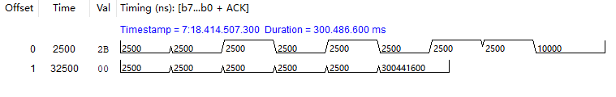
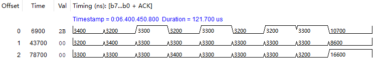
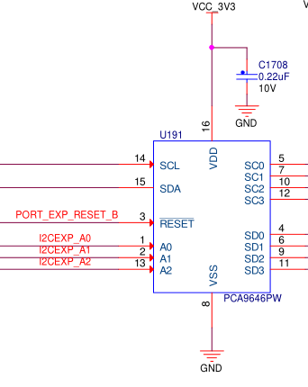
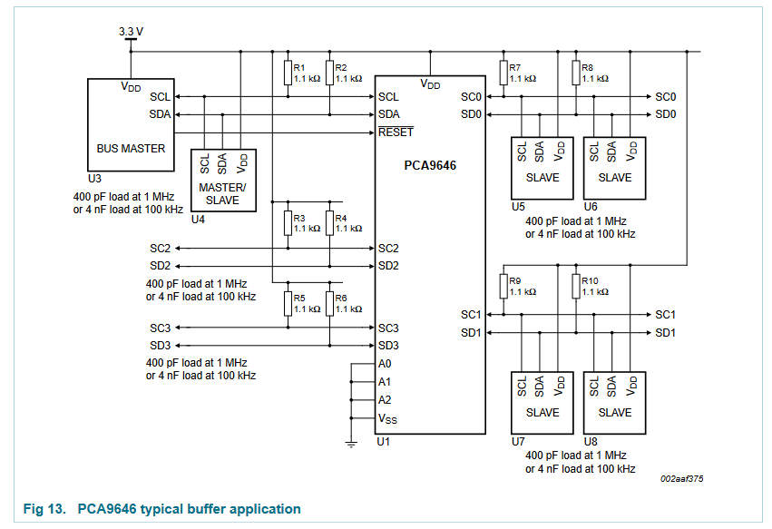

最近在写一个 I2C 设备的 Android 驱动，怎么也不工作。于是拿出逻辑分析仪，发现波形很奇怪。在第二个字节的时候，最开始的几个比特没有了。由于手头没有示波器，所以只有逻辑分析仪的简单波形。

正确的波形应该像下面这个样子。

看到这个波形，很自然地想到了 Clock Stretching（很自然？并没有，虽然知道 Slave 设备可以 Hold 总线，但根本没往这里想，也根本不知道它还有个名字）。

# Clock Stretching 简介

不明所以之际，只能再将 I2C 的标准[^2]拿出来翻翻。发现有下面这段话：

> 3.1.9 Clock stretching
Clock stretching pauses a transaction by holding the SCL line LOW. The transaction
cannot continue until the line is released HIGH again. Clock stretching is optional and in
fact, most target devices do not include an SCL driver so they are unable to stretch the
clock.
**On the byte level, a device may be able to receive bytes of data at a fast rate, but needs
more time to store a received byte or prepare another byte to be transmitted. Targets can
then hold the SCL line LOW after reception and acknowledgment of a byte to force the
controller into a wait state until the target is ready for the next byte transfer in a type of
handshake procedure** (see Figure 7).
On the bit level, a device such as a microcontroller with or without limited hardware for
the I2C-bus, can slow down the bus clock by extending each clock LOW period. The
speed of any controller is adapted to the internal operating rate of this device.
In Hs-mode, this handshake feature can only be used on byte level (see Section 5.3.2).

注意我标粗的这段话。通俗地说，由于 CLK 是由 Master 控制的，但有些 Slave 力不从心，有时会跟不上 Master 的节奏，这时 Slave 就可以拉低 CLK 来 Hold 住总线，让 Master 等一等，相当于一个流控机制。一般来说，Master 是必须支持 Clock Stretching 的，通常是硬件实现的。

# I2C 交换机

联想到这个 I2C 并不是直连芯片，而是经过了一个 I2C 交换机（Bus Switch），PCA9646[^1]。所以问题可能出在这里。

I2C Bus Switch 到底有啥用呢，明明 I2C 自己就可以接多个设备，为什么需要一个 Switch 呢？简单来说，是为了隔离低速设备，让一个总线同时支持不同的速度。

以上图为例，假设 U4/5/6 是高速设备，U7/8 是低速设备。假设这些设备都连到同一个总线上，当 Master 和 U7/8 通信时，通常高速设备可以兼容低速设备，所以没有问题。但当 Master 和 U4/5/6 通信的时候，由于 CLK 速度过快，低速设备可能会被影响，从而工作异常。所以需要通过 PCA9646 隔离。

果然在 PCA9646 的芯片手册里有这样一句话：

> Clock stretching and timing must always be under control of the master device。

也就是其不支持 Slave 设备 Hold 总线。

[^1]: https://www.nxp.com/docs/en/data-sheet/PCA9646.pdf PCA9646 I2C Switch Datasheet
[^2]: https://www.nxp.com/docs/en/user-guide/UM10204.pdf I2C Specification
