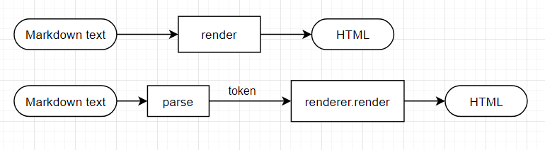
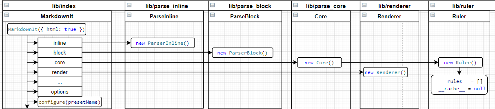
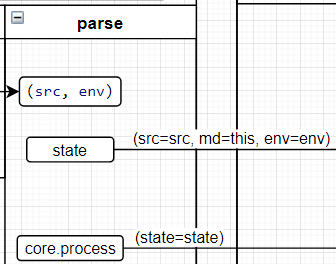
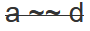

1. markdown-it 源码分析及插件编写：parse 和 token（1/3）《==本文
2. markdown-it [源码分析及插件编写：render（2/3）](https://zhuanlan.zhihu.com/p/401550182)
3. markdown-it [源码分析及插件编写：Plugin 插件编写（2/3）](https://zhuanlan.zhihu.com/p/437391859)

[markdown-it](https://github.com/markdown-it/markdown-it) 可能是最流行的 JavaScript Markdown 库，它的使用很简单，并支持插件。

但由于它的文档很是晦涩，想写一个插件也不知从何下手。所以这里只能使用最笨办法，读源代码。下面的内容希望能给编写插件的你带来一些启发。

# 使用 markdown-it

在解释源码之前，先来看一下 markdown-it 的用法。这样，你就会对 markdown-it 有一个大体的了解。

使用时可以直接调用 `render` 将 Markdown 转换成 HTML。也可以先调用 `parse` 将 Markdown 转换成 token，再调用 `renderer.render` 将 token 转换成 HTML。



其实上面两个流程是一样的，`render`只是调用了`parse`和`renderer.render`而已。

为了清晰，这里把它们分开来讲。先讲解如何将 markdown `parse`到 tokens，再讲解如何`render`tokens 到 HTML。

```js
// 步骤1. 导入markdown-it库
var MarkdownIt = require("markdown-it");
// 步骤2. 实例化，这一步可以传入相应的配置
md = new MarkdownIt();
// 步骤3. 将Markdown解析为token
t = md.parse("# xxx");
// 步骤4. 将token转换为HTML
md.renderer.render(t);
```

下面我们就开始深入源代码。建议读者在阅读下面内容之前，先试着使用一下，不至于下面的阅读云里雾里。强烈建议读者从上面的链接 clone 一份源码，并跟着下文一起阅读。

步骤 1 没什么好说的，我们从步骤 2 开始。

# 步骤 2. 实例化

实例化做的事情并不复杂，初始化了几个变量，再对 config 进行了处理。由于本部分对代码逻辑的理解没有太大影响，所以不做过多解释。下面是大致的框图：



# 步骤 3. 将 Markdown 解析为 token

## token 介绍

在分析具体的代码之前，我们不妨看看生成的 token 是什么样子。

例一

```md
我是一个普通句子。
```

这个例子 parse 完之后得到的是一个长度为 3 的 token，为了简洁，仅保留了关键内容，你可以在 <https://markdown-it.github.io/> 查看完整的 token 内容。查看 token，请点击右上角的 debug。

```js
[
  // token 1
  {
    type: "paragraph_open",
    tag: "p",
    map: [0, 1],
    nesting: 1,
  },
  // token 2
  {
    type: "inline",
    map: [0, 1],
    nesting: 0,
    children: [
      {
        type: "text",
        content: "我是一个普通句子。",
      },
    ],
    content: "我是一个普通句子。",
  },
  // token 3
  {
    type: "paragraph_close",
    tag: "p",
    nesting: -1,
  },
];
```

一头一尾很好理解。中间的 token 类型为`inline`，它包含一个`children`乘员，里面是子 token。这里首先强调，我们可以认为子 token 和`inline`类型是绑定在一起的。子 token 的作用可以通过下面的例子理解。

例二

```md
我是一个**不普通**句子。
```

```js
[
  // token 1
  {
    type: "paragraph_open",
  },
  // token 2
  {
    type: "inline",
    // 下面的内容是子token
    children: [
      {
        type: "text",
        content: "我是一个",
      },
      {
        type: "strong_open",
        tag: "strong",
        nesting: 1,
        markup: "**",
      },
      {
        type: "text",
        nesting: 0,
        content: "不普通",
      },
      {
        type: "strong_close",
        tag: "strong",
        nesting: -1,
        markup: "**",
      },
      {
        type: "text",
        content: "句子。",
      },
    ],
    content: "我是一个**不普通**句子。",
  },
  // token 3
  {
    type: "paragraph_close",
  },
];
```

这里我们可以看到，由于有标记的存在，需要子 token 进行处理。所以，整个 parse 的框架大概是这样的：

1. 先识别出大的 block，并生成最顶层的 token，如上例有三个顶层 token
2. 第二个 token 类型为`inline`，需要进一步处理为子 token

上面两个步骤，就是 parse 的核心规则。

上面的 token，我还保留了其它一些重要（对理解源码而言）字段，如`map`，`nesting`等。这里简单介绍，只望大家有个印象。

- `nesting`：嵌套级别，对应 html 就很好理解。Html 标签有开有闭，开就对应 1，闭对应-1，中间就是 0.
- `map`：表示 token 对应的 markdown 文本的位置，分别是开始行（包括），结束行（不包括）。
- `tag`：对应 html 标签，如`<p>`，`<strong>`等。如果没有特别指定，renderer.render 将使用这个 tag 直接生成对应的 html 文本。

## parse 核心流程

parse 调用是我们的重点。分为两步

1. 初始化 state（`core.State`）
2. 调用`core.process`



我们不妨看看这个两部走的模式。markdown-it 库的好多地方都是类似这样的，先初始化一个 state，用于保存状态信息，再进行具体的处理。但要注意，不同的地方它们的 state 也是完全不同的，除了名字。

对于`core.state`，我们只要知道 token 就保存在`core.state.tokens`中，tokens 是一个 Array。

`core.process`也是相当的简单，仅仅是应用了预定义的规则（规则列表在`lib/parser_core.js`中），这些规则就是重中之重。

下面我们介绍主要规则。除了下面的两个规则，其它规则不影响代码的理解，这里不做过多介绍，比如第一个规则是`normalize`，这个规则很简单，就是统一换行符（我们知道不同的操作系统，默认的换行符是不一样的），并且删除没用的空字符。

回忆上面说的 parse 的框架

    1. 先识别出大的block，并生成最顶层的token
    2. 对于类型为`inline`的token，需要进一步处理为子token

所以最主要的两个规则就是`block`规则和`inline`规则。

## `block`规则

注意这个规则定义在`rules_core/block`中，它会调用`parser_block`。

### 1. block 规则首先会初始化自己的 State

注意 parser_core, parser_inline, parser_block 的 State 是不同的

- this.src 保存了 normalize 之后的 markdown 全文
- this.lineMax 保存了行数
- this.line 初始化为 0

在 State 中，保存了每一行的下列信息：

- bMarks：每一行开始的 index（包括行首空格）
- eMarks：每一行行尾 index（指向换行，最后一行可能没有换行符，那就指向最后一个字符）
- tShift：每一行行首的空白符数量，tab 算一个，程序中位置跳转会用到
- sCount：每一行行首的空白符数量，tab 展开，视位置算 1~4 个。分析 markdown 逻辑时需要用到

### 2. this.tokenize(state, state.line, state.lineMax);

tokenize 会调用各个 block 规则（规则列表在`lib/parser_block.js`中），block 规则按顺序匹配，如果一个匹配成功（返回 true）就不再匹配下一个。

如果匹配成功：

- 更新 state.line 为匹配 block 的最后一行的后一行
- 往 state push 一个新 token，并修改
  - content 为整个 block 的内容
  - map 为[开始行， 结束行下一行]，遵循惯例是一个左闭右开区间

当 block 规则匹配完成后，我们可以确保所有的行都被包含在 token 之内，因为有 paragraph 规则托底。

如果希望 token 进一步使用 inline 规则，需要在 push token 的时候设置规则为 inline。inline 规则的结果会保存在 children 中。

### 嵌套 block 的处理

上面我们可以看到，block 是挨个匹配的，如果一个 block 里面有另一个 block 怎么办呢？
比如下面的，在 list block 中有一个代码（markdown-it 里称其为 fence）

````md
- ```js
  var a;
  ```
````


在parse_block.js中查看其规则：

```js
 [ 'fence',      require('./rules_block/fence'),      [ 'paragraph', 'reference', 'blockquote', 'list' ] ],
````

我们可以看到，规则的最后是个`list`，我们称其为`alt`。上面那一行规则的意思就是：一个名为`'fence'`的规则，其定义在`require('./rules_block/fence')`中，它可以嵌套在规则`'paragraph'`，`'reference'`，`'blockquote'`和`'list'`中。

## `inline`规则

这个规则和 block 规则是紧密练习在一起的。与 block 不同，`ParserBlock.prototype.parse`只调用了一次，而`ParserInline.prototype.parse`针对每个 inline 类型的 token 都调用了一次。同时我们注意到 state 与 parse 的调用是绑定在一起的，所以每个 inline token 都有自己独立的 state。

整体而言，inline 的 parse 和 block 差不多，都是先 new 一个 state，再 tokenize。但 inline 多了一个 post process 的过程，即应用 ruler2。

Inline 规则也有一个类似 block 的托底规则（`lib\rules_inline\state_inline.js`）,当向 state 中 push 新的 token 时，会将当前未处理的（pending）的字符串作为文本（`text`）类型先 push 到 token 中。

```js
// Push new token to "stream".
// If pending text exists - flush it as text token
//
StateInline.prototype.push = function (type, tag, nesting) {
  if (this.pending) {
    this.pushPending();
  }
  ...
}
```

### 1. 初始化 state

- src：当前 token 的 content
- pos：初始化为 0
- posMax：src 的长度

### 2. this.tokenize(state);

这个和 block 的流程几乎是一样的。下面讲几个重点的规则：

#### Inline rule：text

第一个规则叫 **text**。text 规则的主要目的是为了加快 parse 的速度。还记得上面我们说过，block 的规则是一行一行匹配的，照此类推，inline 就是一个字符一个字符地匹配。但显然这样做的话会对速度有明显的影响。所以，这个规则的作用就是跳过普通字符，停留在特殊字符，然后在特殊字符的位置匹配其它规则，这也是这个规则排在第一个的原因。

这些特殊字符包括：

```md
!, ", #, $, %, &, ', (, ), \*, +, ,, -, ., /, :, ;, <, =, >, ?, @, [, \, ], ^, \_, `, {, |, }, or ~
```

其中，`{}$%@~+=:` 虽然没有被标准的 markdown 语法（[CommonMark](https://commonmark.org/)）用到，但它们也被当做特殊字符，以方便插件的开发。同样由于速度的原因，目前没有开放插件删减特殊字符的功能。

#### Inline rule：newline

这个规则就和他的名字一样，用于处理换行。这个规则很简单，就留给读者作为习题了。

#### Inline rule：escape

注意这个转义规则指的的 Markdown 自己的转义，和 HTML 的转义没有关系。

当反斜杠遇到下面字符时会转义：`` \!"#$%&\'()*+,./:;<=>?@[]^_`{|}~- ``。

反斜杠的另一个作用和换行有关。如果反斜杠后面紧跟一个换行符，会促发一个`'hardbreak'`。

其它字符前的反斜杠会原样输出。

知道了上面的标准，这个规则也就很简单了。

#### Inline rule：backticks

一般用作行内的代码`` `int a;` ``。由于这个规则没有嵌套其它规则，也没有转义，所以比较简单。

但是这个规则有一些奇奇怪怪的规定，比如：


为了实现上面的 corner case，里面有些比较啰嗦的东西，大家无需纠结。关于这个奇奇怪怪的规则，我们在后面会详细讲解。

#### Inline rule：~~strike through~~

匹配到`~~`的时候，先 push 一个类型是`text`的 token，再将`content`设置为`~~`。然后还 push 了一个 delimiter，包含以下字段

```js
marker: marker, // 标记符号，这里就是~
length: 0,     // disable "rule of 3" length checks meant for emphasis
jump:   i / 2, // for `~~` 1 marker = 2 characters，一般情况下就是0
token:  state.tokens.length - 1, // 对应token的索引
end:    -1, // 假如这是个开标记的话，用于balance pair这个post规则存储对应的闭标记索引，见下文
open:   scanned.can_open, // 见下面的解释
close:  scanned.can_close // 见下面的解释
```

根据规定，`~~`需要紧连着文本。如`~~a~~`是有效的标记。`~~ a~~`和`~~a ~~`就都是无效的标记，其中前者`can_open`为 false，后者`can_close`为 false。所以`~~a ~~ d~~`会被渲染为：。

同时要注意的是，在 tokenize 阶段，不会对标记的开闭进行匹配。

虽然没有每个规则都讲一遍，但上面这些规则几乎已经涵盖了方方面面的内容了。其余的规则读者有空可以自己研究。

### 3. Post 规则

`inline`和`block`不一样的地方在于`inline`多了 post 规则，也就是源代码中的`ruler2`。根本原因是在解析 inline 本文时，很多标记是上下文相关的，如`**`。每一个合法的强调标记`**`必须是一对儿，而 token 是从前往后按顺序匹配规则的，所以需要这个 post 规则做后处理。

所以 post 规则最关键的一个规则就是给各种标记配对。上面的 tokenize 阶段，已经把所有的标记都给匹配了，但是还没有给每个标记正确地左右配对。

#### 标记配对

简单介绍以下 CommonMark，Markdown 有很多的实现，每个实现的细节都有细微的不同。所以一些人试图对其进行标准化，CommonMark 便是其中的一个使用比较广泛的标准。Markdown-It 也遵循 CommonMark 标准。其它采纳 CommonMark 的实体包括：GitHub，Qt，Stack Overflow 等等。比如 GitHub Flavored Markdown (GFM)是 CommonMark 的[超集](https://github.blog/2017-03-14-a-formal-spec-for-github-markdown/)。

这里我们不妨把 inline 规则暂且放一放，来看看标记的开闭是如何匹配的。

这个规则叫做 balance pair，属于 post 规则，是 post 规则的第一个规则。Post 规则在所有的 inline 规则执行后才执行。

为了讲解这个规则，需要介绍一个 CommonMark 中的一个规划：「三的规则（rule of 3）」。CommonMark 一个 Markdown 标准化的实践，「三的规则」定义在当前规范（v0.30）的 6.2 小结《Emphasis and strong emphasis 》的规则 9 和 10 中。

> 9. Emphasis begins with a delimiter that can open emphasis and ends with a delimiter that can close emphasis, and that uses the same character (\_ or \*) as the opening delimiter. The opening and closing delimiters must belong to separate delimiter runs. If one of the delimiters can both open and close emphasis, then the sum of the lengths of the delimiter runs containing the opening and closing delimiters must not be a multiple of 3 unless both lengths are multiples of 3.

10 和 9 类似，只是把 Emphasis 改成了 Strong emphasis 。这段话还是比较晦涩的，我通过一个官方的例子进行讲解。

在`*foo**bar**baz*`中可以有以下两种解释方法，

1. 三个单独的`*foo*`，`*bar*`，`*baz*`。
2. 就一个`*xxx*`，其中 xxx 是`foo**bar**baz`。当然中间还有一个嵌套的`**bar**`。

显然，这就有歧义了。CommonMark 标准更偏向于第二种，即 Strong emphasis 被嵌套在 Emphasis 之中，于是便有了上面的规则。我们继续看这个例子是如何排除第一中情况的。在第一种情况中，`*foo*`的开标记（左边的星号）所属的组（即 delimiter runs）是它自己，即`*`，而闭标记（右边的星号）的 delimiter runs 是`**`。它们的长度加起来就是 3，规则 9 的规定就是这个长度不能是三的倍数（除非开闭标记的长度都是三的倍数），从而排除了第一种情况。

当然还是建议大家写 Markdown 的时候还是不要依赖这些奇奇怪怪的规则为好，毕竟我们使用 Markdown 的初衷就是简洁，勿忘初心。

到了这里，标记配对所作的工作就很好理解了，就是为每一个开标记找到对应的闭标记，保存 index 在上面讲到的`end`字段中。源代码由于上面乱七八糟规则的原因同样是优点晦涩，大家看的时候也不用纠结。

#### Inline rule：~~strike through~~ 续

我们再回到 strike through 这个规则，继续讲解与之对应的 post 规则。上面我们说到，balance pair 帮我们匹配好了对应的开闭标记，strike through 的 post 规则就把对应的 token 的类型改成了`s_open`和`s_close`，回顾前面，原先我们 push 的 token 的类型都是`text`。

理解了上面这些规则，其它的规则就很好理解了，都是类似的，就不再重复分析了。

# 结语

本系列的第一个部分到这里就结束了，但感觉还是有点乱的，后期还会继续完善，欢迎追更。

本系列还会再有两篇文章，分别讲述渲染（renderer）和插件编写，欢迎关注本专栏以待后续更新。
