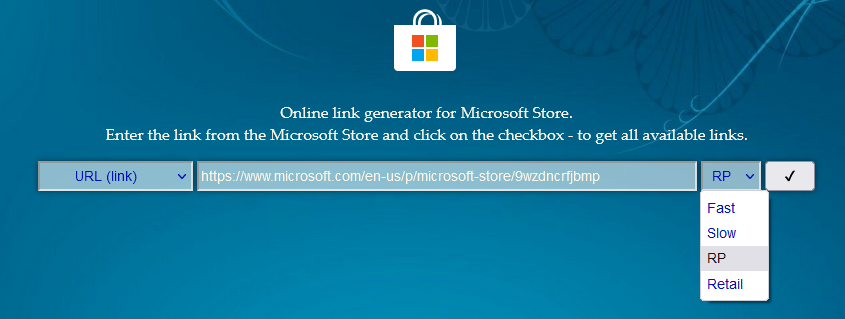

多年前，因听信谣言，亲手卸载了 Windows 应用商店，并且卸载得很彻底，好几次想要重新安装，但是每次都是失败的。

网上[一般的安装方法](https://answers.microsoft.com/zh-hans/windows/forum/all/%E5%AE%89%E8%A3%85%E5%BE%AE%E8%BD%AF%E5%95%86/1a112e23-6320-44f2-a2bf-0a4a3519a188)是这样的：

```ps1
PS > get-appxpackage *store* | remove-Appxpackage 
PS > add-appxpackage -register "C:\Program Files\WindowsApps\*Store*\AppxManifest.xml" -disabledevelopmentmode 
```

但是一直不成功，于是去外网搜索了一下，发现有一个可用的方法。简单来说就是将应用商店的安装包下载下来，然后手动安装。

以下内容参考 [Restore Microsoft Store in Windows 10 after uninstalling it with PowerShell](https://www.winhelponline.com/blog/restore-windows-store-windows-10-uninstall-with-powershell/)

1. 首先打开网页 <https://store.rg-adguard.net/>，在这个网页上可以下载到 Windows 应用商店的安装包。
2. 在搜索框输入 `https://www.microsoft.com/en-us/p/microsoft-store/9wzdncrfjbmp`（这是 Windows 应用商店的网页地址），并选择`Retail`
   
3. 下载搜索结果中的安装包
   
   * 注意，除了 Windows 应用商店的安装包外，还有其他的安装包，这些安装包是依赖包，也需要下载。包括：
     - `Microsoft.NET.Native.Framework`
     - `Microsoft.NET.Native.Runtime`
     - `Microsoft.UI.Xaml`
     - `Microsoft.VCLibs`
     - `Microsoft.WindowsStore`
   * 有些包是 Appx 后缀，也有 Msixbundle
   * 请忽略 BlockMap 后缀的文件
   * 注意选择最新版本
   * 注意选择正确的构架（一般是 `x64`）
4. 按照上面的顺序按下面的方法安装，注意由于商店不存在，无法双击安装
   1. 以**管理员权限**打开 PowerShell
   2. 进入下载目录 （cd）
   3. 使用如下命令依次安装
      `Add-AppxPackage -Path .\packet.file.appx`
   注意，有些包会安装失败，提示资源正在被使用什么的（resources it modifies are currently in use），可以尝试在资源管理器中关闭对应的进程。如果找不到对应的进程，也可以直接忽略这个错误。 

终于，失去的 Windows 应用商店又回来了。
