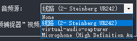
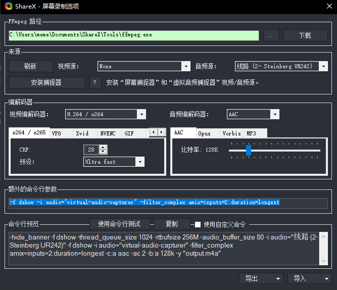

ShareX 是一个**开源**的屏幕录制和截图软件。最近想要录制声音，于是按照[网上的教程](https://www.bilibili.com/read/cv1724010)，在「动作设置」-「屏幕记录」-「屏幕录制选项」中安装了捕捉器，然后就可以录制声音了。

# 背景

但是发现一个问题，无法同时录制系统声音和麦克风声音。

如上图所示，选项中有三个音频源（更具配置不同会有差异）

1. `线路 (2- Steinberg UR242)`，这是我的话筒
2. `virtual-audio-capturer`，这就是系统声音源，如果你按照上面的步骤正确安装了捕捉器，这个选项就会出现
3. `Microphone (High definition Audio Device)`，这是我的笔记本内置的麦克风

如果我选择 1 的话，就只会有话筒的声音，如果选择 2 的话，就只有系统声音。

网上说需要通过「麦克风设置侦听用电脑来播放」来解决这个问题。从原理上来讲应该是可以的（顺便解决了耳返的问题）。但是总感觉这个方法有点歪门邪道的感觉，并且我的声卡是自带耳返的。其实主要是我没有找到这个选项。所以就没有使用这个方法。

# 最终解决方案

最终我在 [SuperUser](https://superuser.com/questions/1566658/sharex-record-screen-audio-along-with-microphone) 上找到了一个相对好的解决方法。简单来说，就是通过额外命令行参数的方法同时录制两个音频源。

方法分两步：
1. 在上面音频源选择的地方，选择你的麦克风。以我上面的为例就是`线路 (2- Steinberg UR242)`。
2. 如下图所示，将 `-f dshow -i audio="virtual-audio-capturer" -filter_complex amix=inputs=2:duration=longest` 添加到额外的命令行参数中。

这样就可以同时录制系统声音和麦克风声音了。
