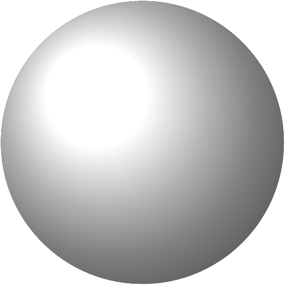
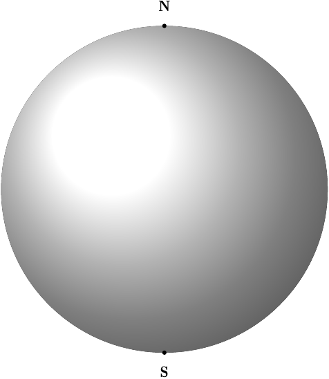
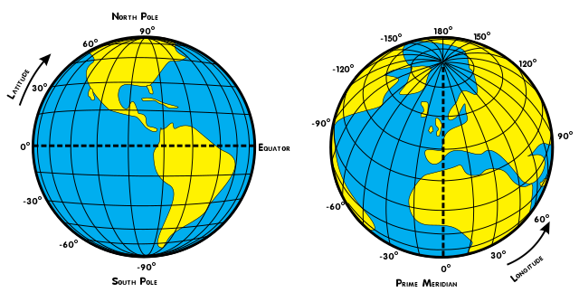
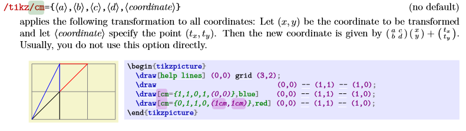
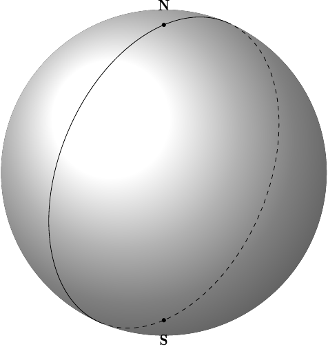
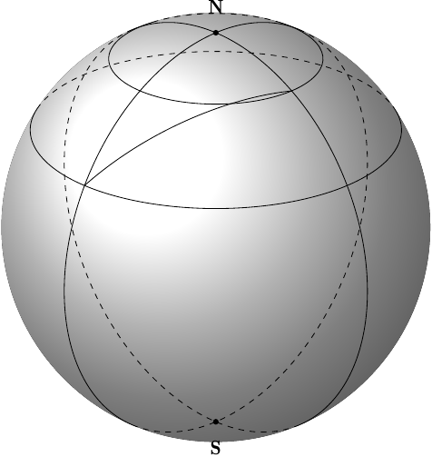

# 背景介绍

最近用 $\TeX$ 在写一篇球面坐标系相关的文章，所以便在往上寻找 3d 作图相关的信息。最终找到的如下的[例子](https://texample.net/tikz/examples/spherical-and-cartesian-grids/)。


但是，这个例子还没有达到我的要求：

1. 只支持经线和纬线，不支持任意的大圆（Great Circle）。
2. 代码有点晦涩，不容易看懂；主要是因为相关的数学知识完全没有介绍

所以本文的重点主要就是解决以上两个问题：
1. 循序渐进地讲解数学知识
2. 介绍如何将数学公式转换为相关的 $\TeX$ 代码
3. 实现任意大圆的作图

# 画一个地球

```tex
\begin{figure}[ht!]
\begin{tikzpicture}	
	\def\R{4} % 切面半径
	\fill[ball color=white!10] (0,0) circle (\R); % 3D 效果的球
\end{tikzpicture}
\end{figure}
```

为了本文简洁起见，后文省略代码中的 `figure` 和 `tikzpicture` 环境。




# 南极和北极

```tex
\coordinate[mark coordinate] (N) at (0,\R);
\coordinate[mark coordinate] (S) at (0,-\R);
\node[above=8pt] at (N) {$\mathbf{N}$};
\node[below=8pt] at (S) {$\mathbf{S}$};
```



其中 `mark coordinate` 的定义如下：

```tex
\tikzset{%
  >=latex, % option for nice arrows
  inner sep=0pt,%
  outer sep=2pt,%
  mark coordinate/.style={inner sep=0pt,outer sep=0pt,minimum size=3pt,
    fill=black,circle}%
}
```

我们对比一下上面的图片和下面的图片：



可见为了美观，有时地球需要向前倾斜一点。我们不妨定义这个角度为 $\gamma$，上图中，左图 $\gamma=0$，右图 $\gamma=25\degree$（大概）。

# 地球的经线

我们从简单的经线开始，我们约定右边是 0° 经线，左边是 180° 经线。

由于 tikz 的是一个平面的作图系统，右为 x 的正向，上为 y 的正向。为了和我们的三维作图相适应，我们以右手系的形式想象出一个指向我们的 z 方向，那么 tikz 实际显示的图片就是三维图形在 xy 平面的投影。

我们不妨想象一下一个 $\lambda\degree$ 的经线是如何从 0° 经线变换而来的：
1. 绕 y 轴旋转 $\lambda\degree$ （东正西负）
2. 绕 x 轴旋转 $\gamma\degree$

类似的在我们的代码中也分两步走：
1. 画一个 0° 经线
2. 对其应用上面两个变换

相信大家都很清楚，绕一个轴旋转可以简单地用一个矩阵来表示，所以下面地矩阵就可以表示上面地旋转

$$
\left[\begin{array}{ccc}
  1 & 0 & 0\\
  0 & \cos\gamma & -\sin\gamma\\
  0 & \sin\gamma & \cos\gamma\\
\end{array}\right] \left[\begin{array}{ccc}
  \cos\lambda & 0 & \sin\lambda\\
  0 & 1 & 0\\
  -\sin\lambda & 0 & \cos\lambda\\
\end{array}\right] = \left[\begin{array}{ccc}
  \cos\lambda & 0 & -\sin\lambda\\
  \sin\gamma\sin\lambda & \cos\gamma & -\sin\gamma\cos\lambda\\
  -\cos\gamma\sin\lambda & \sin\gamma & \cos\gamma\cos\lambda\\
\end{array}\right]
$$

由于我们只需要在 xy 平面地投影，以及原始的 0° 经线的 z 轴坐标为0，所以只需要上边矩阵的左上角。

$$
\left[\begin{array}{ccc}
  \cos\lambda & 0 \\
  \sin\gamma\sin\lambda & \cos\gamma
\end{array}\right]
$$

在 tikz 中，我们可以用 `cm` 来应用这个变换。



我们通过 `cm` 定义 `\LongitudePlane` 命令。
```tex
% 参数1：【可选】变换的名字，默认 `current plane`
% 参数2：极点的倾斜角
% 参数3：经度（东正西负）
\newcommand\LongitudePlane[3][current plane]{
  \tikzset{#1/.estyle={cm={cos(#3),sin(#3)*sin(#2),0,cos(#2),(0,0)}}}
}
```

可以看到，这个平面的默认名称（第一个参数）为`current plane`。第二个参数是北极点的倾斜角度，正常我们看一个三维的地球的时候，北极点并不是在最上方的，因为这样不够美观。通常我们会让北极点向前倾20到30度，相应的，南极点就看不到了。第三个参数就是经度值。

```tex
\def\R{4} % 切面半径
\def\AngleGamma{25} % 极点倾斜角
\pgfmathsetmacro\CosGamma{cos(\AngleGamma)} % pgfmathsetmacro 可以进行 cos 计算，def 不行
\fill[ball color=white!10] (0,0) circle (\R); % 3D 效果的球

\coordinate[mark coordinate] (N) at (0,\R*\CosGamma);
\coordinate[mark coordinate] (S) at (0,-\R*\CosGamma);
\node[above=8pt] at (N) {$\mathbf{N}$};
\node[below=8pt] at (S) {$\mathbf{S}$};

\LongitudePlane{\AngleGamma}{45}
	\draw[current plane] circle (\R);
```

这样我们就可以画一个经线了。


从这里我们可以看到两个问题：
1. 经线其实是一个半圆，所以上图其实是「东经 45°」和「西经 135°」的经线。但通常我们都会画一个圆，所以我们忽略这个问题。
2. 经线其实有一段是被地球挡住的，我们应该看不见，所以应该画成虚线

所以我们通过以下代码计算出交点角度，其实对于这个角度是怎么算出来的我也是一知半解，希望知道的读者能详细解释一下：

```tex
% 参数1：【可选】极点的倾斜角，默认 `\AngleGamma`
% 参数2：地球半径
% 参数3：经度（东正西负）
\newcommand\DrawLongitude[3][\AngleGamma]{
  \LongitudePlane{#1}{#3}
  \tikzset{current plane/.prefix style={scale=#2}}
   % angle of "visibility"
  \pgfmathsetmacro\angVis{atan(sin(#3)*cos(#1)/sin(#1))} %
  \draw[current plane,thin,black] (\angVis:1) arc (\angVis:\angVis+180:1);
  \draw[current plane,thin,dashed] (\angVis-180:1) arc (\angVis-180:\angVis:1);
}
```

然后只要一句话就可以画出经线了：

```tex
\DrawLongitude{\R}{45};
```



# 地球的纬线

纬度平面和经度平面类似。

纬度和经度类似

```tex
% 参数1：【可选】变换的名字，默认 `current plane`
% 参数2：极点的倾斜角
% 参数3：维度（北正南负）
\newcommand\LatitudePlane[3][current plane]{
  \pgfmathsetmacro\yshift{cos(#2)*sin(#3)}
  % 下面 cm 的最后一个参数不能出现乘法，所以定义了 yshift
  \tikzset{#1/.estyle={cm={cos(#3),0,0,cos(#3)*sin(#2),(0,\yshift)}}}
}
% 参数1：【可选】极点的倾斜角，默认 `\AngleGamma`
% 参数2：地球半径
% 参数3：维度（北正南负）
\newcommand\DrawLatitude[3][\AngleGamma]{
  \LatitudePlane{#1}{#3}
  \tikzset{current plane/.prefix style={scale=#2}}
  \pgfmathsetmacro\sinVis{sin(#3)/cos(#3)*sin(#1)/cos(#1)}
  % angle of "visibility"
  \pgfmathsetmacro\angVis{asin(min(1,max(\sinVis,-1)))}
  \draw[current plane,thin,black] (\angVis:1) arc (\angVis:-\angVis-180:1);
  \draw[current plane,thin,dashed] (180-\angVis:1) arc (180-\angVis:\angVis:1);
}
```

然后通过以下代码就可以画出一个纬线

```tex
\DrawLatitude{\R}{30};
```


# 任意两点之间的大圆弧

我们假设有左右两个点$(\lambda_{Lhs}, \phi_{Lhs})$和$(\lambda_{Rhs}, \phi_{Rhs})$，
我们按照以下思想画出这个大圆弧。

1. 以经度0和纬度0为起点，沿着0°经线向北画一个角度为c的圆弧。
2. 沿着x轴旋转$\alpha\degree$
3. 绕z轴旋转$\phi_{Lhs}\degree$
4. 然后绕y旋转$\lambda_{Lhs}\degree$
5. 最后再绕x轴旋转$\gamma\degree$（下文有时也将这个角称为$\zeta$）

上面的步骤中有两个未知量，一个是角度c，一个是$\alpha$。

## 计算角度 c

显然这个角度 c 就是我们要画的大圆弧弧长（由于我们这里是单位圆球，所以在弧度制不用区分弧长还是角度，请读者依据上下文自由切换）。所以这里我们的问题就变成了已知两个点$(\lambda_{Lhs}, \phi_{Lhs})$和$(\lambda_{Rhs}, \phi_{Rhs})$，求它们的弧长。

这个问题有[现成的公式](https://www.movable-type.co.uk/scripts/latlong.html)（这里就不作推导了）：

$$
a = sin²(Δφ/2) + cos φ1 ⋅ cos φ2 ⋅ sin²(Δλ/2) \\
c = 2 ⋅ atan2(\sqrt{a}, \sqrt{1−a})
$$

## 计算 $\alpha$

这个 $\alpha$ 在球面三角学中叫 Bearing（差一个负号），也有[现成的公式](https://www.movable-type.co.uk/scripts/latlong.html)

$$
y = sin Δλ ⋅ cos φ2 \\
x = cos φ1 ⋅ sin φ2 − sin φ1 ⋅ cos φ2 ⋅ cos Δλ \\
θ = atan2( y , x ) \\
\alpha = -θ
$$

上面的步骤 2~5 都是旋转，我们用矩阵表示，由于比较长，我们分成两步。下面的$(\lambda, \phi)$指的是$(\lambda_{Lhs}, \phi_{Lhs})$。

步骤 2~4：
$$
  \left[\begin{array}{ccc}
    \cos\lambda & 0 & \sin\lambda\\
    0 & 1& 0\\
    -\sin\lambda & 0 & \cos\lambda\\
  \end{array}\right]
  \left[\begin{array}{ccc}
    \cos\varphi & -\sin\varphi & 0\\
    \sin\varphi & \cos\varphi & 0\\
    0 & 0& 1\\
  \end{array}\right]
  \left[\begin{array}{ccc}
  1 & 0 & 0\\
  0 & \cos\alpha & -\sin\alpha\\
  0 & \sin\alpha & \cos\alpha\\
\end{array}\right] = \\
\left[\begin{array}{ccc}
  \cos\lambda & 0 & \sin\lambda\\
  0 & 1& 0\\
  -\sin\lambda & 0 & \cos\lambda\\
\end{array}\right]
\left[\begin{array}{ccc}
  \cos\varphi & -\sin\varphi\cos\alpha & \sin\varphi\sin\alpha\\
  \sin\varphi & \cos\varphi\cos\alpha& -\cos\varphi\sin\alpha\\
  0 & \sin\alpha & \cos\alpha\\
\end{array}\right] = \\
\left[\begin{array}{ccc}
  \cos\lambda\cos\varphi & -\cos\lambda\sin\varphi\cos\alpha+\sin\lambda\sin\alpha & \cos\lambda\sin\varphi\sin\alpha+\sin\lambda\cos\alpha\\
  \sin\varphi & \cos\varphi\cos\alpha& -\cos\varphi\sin\alpha\\
  -\sin\lambda\cos\varphi & \sin\lambda\sin\varphi\cos\alpha+\cos\lambda\sin\alpha & -\sin\lambda\sin\varphi\sin\alpha+\cos\lambda\cos\alpha\\
\end{array}\right]
$$

在加上步骤5：
$$
  \left[\begin{array}{ccc}
    1 & 0 & 0\\
    0 & \cos\zeta & -\sin\zeta\\
    0 & \sin\zeta & \cos\zeta\\
  \end{array}\right]
\left[\begin{array}{ccc}
  \cos\lambda\cos\varphi & -\cos\lambda\sin\varphi\cos\alpha+\sin\lambda\sin\alpha & \cos\lambda\sin\varphi\sin\alpha+\sin\lambda\cos\alpha\\
  \sin\varphi & \cos\varphi\cos\alpha& -\cos\varphi\sin\alpha\\
  -\sin\lambda\cos\varphi & \sin\lambda\sin\varphi\cos\alpha+\cos\lambda\sin\alpha & -\sin\lambda\sin\varphi\sin\alpha+\cos\lambda\cos\alpha\\
\end{array}\right]
= \\
\left[\begin{array}{ccc}
  \cos\lambda\cos\varphi & -\cos\lambda\sin\varphi\cos\alpha+\sin\lambda\sin\alpha & \cos\lambda\sin\varphi\sin\alpha+\sin\lambda\cos\alpha\\
  \cos\zeta\sin\varphi+\sin\zeta\sin\lambda\cos\varphi & \cos\zeta\cos\varphi\cos\alpha-\sin\zeta(\sin\lambda\sin\varphi\cos\alpha+\cos\lambda\sin\alpha)& -\cos\zeta\cos\varphi\sin\alpha+\sin\zeta(\sin\lambda\sin\varphi\sin\alpha-\cos\lambda\cos\alpha)\\
  \sin\zeta\sin\varphi-\cos\zeta\sin\lambda\cos\varphi & \sin\zeta\cos\varphi\cos\alpha+\cos\zeta(\sin\lambda\sin\varphi\cos\alpha+\cos\lambda\sin\alpha)& -\sin\zeta\cos\varphi\sin\alpha-\cos\zeta(\sin\lambda\sin\varphi\sin\alpha-\cos\lambda\cos\alpha)\\
\end{array}\right]
$$

同上，由于我们只需要在 xy 平面地投影，以及原始的 0° 经线的 z 轴坐标为0，所以只需要上边矩阵的左上角。

$$
\left[\begin{array}{ccc}
  \cos\lambda\cos\varphi & -\cos\lambda\sin\varphi\cos\alpha+\sin\lambda\sin\alpha \\
  \cos\zeta\sin\varphi+\sin\zeta\sin\lambda\cos\varphi & \cos\zeta\cos\varphi\cos\alpha-\sin\zeta(\sin\lambda\sin\varphi\cos\alpha+\cos\lambda\sin\alpha) \\
\end{array}\right]
$$

将上面的公式写成 tex 代码（整理得不太好，后期有空再完善/(ㄒoㄒ)/~~）：

```tex
%% 任意大圆

% 参数1：【可选】变换的名字，默认 `current plane`
% 参数2：极点的倾斜角
% 参数3：左侧点的经度
% 参数4：左侧点的纬度
% 参数5：右侧点的经度
% 参数6：右侧点的纬度
\newcommand\ArcThreeDPlane[6][current plane]{
    \pgfmathsetmacro\angleZeta{#2}
    \pgfmathsetmacro\lambdaLhs{#3}
    \pgfmathsetmacro\phiLhs{#4}
    \pgfmathsetmacro\lambdaRhs{#5}
    \pgfmathsetmacro\phiRhs{#6}
    \pgfmathsetmacro\deltaLambda{#5-#3}
    \pgfmathsetmacro\deltaPhi{#6-#4}
    \pgfmathsetmacro\aVar{sin(\deltaPhi/2)*sin(\deltaPhi/2)+cos(\phiLhs)*cos(\phiRhs)*sin(\deltaLambda/2)*sin(\deltaLambda/2)}
    \pgfmathsetmacro\cVar{2*atan2(sqrt(\aVar), sqrt(1-\aVar))}
    \pgfmathsetmacro\yVar{sin(\deltaLambda)*cos(\phiRhs)}
    \pgfmathsetmacro\xVar{cos(\phiLhs)*sin(\phiRhs)-sin(\phiLhs)*cos(\phiRhs)*cos(\deltaLambda)}
    \pgfmathsetmacro\thetaVar{-atan2(\yVar, \xVar)}
	\tikzset{#1/.estyle={cm={cos(\lambdaLhs)*cos(\phiLhs), cos(\angleZeta)*sin(\phiLhs)+sin(\angleZeta)*sin(\lambdaLhs)*cos(\phiLhs), -cos(\lambdaLhs)*sin(\phiLhs)*cos(\thetaVar)+sin(\lambdaLhs)*sin(\thetaVar), cos(\angleZeta)*cos(\phiLhs)*cos(\thetaVar)-sin(\angleZeta)*(sin(\lambdaLhs)*sin(\phiLhs)*cos(\thetaVar)+cos(\lambdaLhs)*sin(\thetaVar)), (0,0)}}}
}
% 参数1：【可选】极点的倾斜角，默认 `\AngleGamma`
% 参数2：地球半径
% 参数3：左侧点的经度
% 参数4：左侧点的纬度
% 参数5：右侧点的经度
% 参数6：右侧点的纬度
\newcommand\DrawArcThreeD[6][\AngleGamma]{
    \pgfmathsetmacro\angleZeta{#1}
    \pgfmathsetmacro\lambdaLhs{#3}
    \pgfmathsetmacro\phiLhs{#4}
    \pgfmathsetmacro\lambdaRhs{#5}
    \pgfmathsetmacro\phiRhs{#6}
    \pgfmathsetmacro\deltaLambda{#5-#3}
    \pgfmathsetmacro\deltaPhi{#6-#4}
    \pgfmathsetmacro\aVar{sin(\deltaPhi/2)*sin(\deltaPhi/2)+cos(\phiLhs)*cos(\phiRhs)*sin(\deltaLambda/2)*sin(\deltaLambda/2)}
    \pgfmathsetmacro\cVar{2*atan2(sqrt(\aVar), sqrt(1-\aVar))}
    \pgfmathsetmacro\yVar{sin(\deltaLambda)*cos(\phiRhs)}
    \pgfmathsetmacro\xVar{cos(\phiLhs)*sin(\phiRhs)-sin(\phiLhs)*cos(\phiRhs)*cos(\deltaLambda)}
    \pgfmathsetmacro\thetaVar{-atan2(\yVar, \xVar)}
	\ArcThreeDPlane{#1}{#3}{#4}{#5}{#6}
    \draw [current plane] (#2, 0) arc (0:\cVar:#2);
}
```

然后我们就可以通过

```tex
\DrawArcThreeD{\R}{-135}{30}{-45}{60};
```

画出一个圆弧了。



完整的代码可以从 [GitHub](https://github.com/jks-liu/jks-template/blob/master/xelatex/jks-template-3d.tex) 获取。

# 后续
上面的任意圆弧还没有不可见部分表示为虚线的功能，后期会完善。
